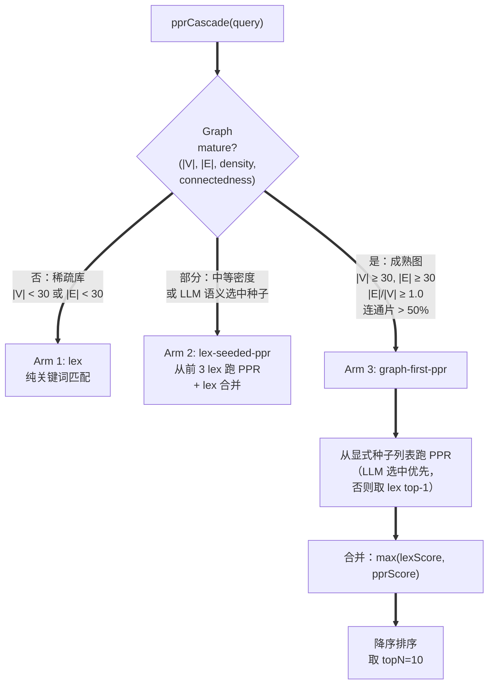

这是 *Inside the System* 系列的第六篇。早前的几篇走过模块化重构、模型选择、摄入延迟、矛盾检测、Schema 提取等主题；本篇打开单一模块的盖子——不是为了表彰它，而是走一遍设计决策、看似昂贵其实不贵的部分、以及看似廉价其实不便宜的部分。今天的模块是 v1.23.0 的图引擎，具体来说，是驱动 Hub 识别、链接区分度、以及查询时检索的蒙特卡洛个性化 PageRank 基元。

如果你只想看面向用户的故事，请读[Announcement: v1.23 — Link Graphs as a Search Index](/zh/blog/posts/v123-graph-engine-ai-sdk)。本文假设你愿意在一个 100 行 TypeScript 文件里待上 15 分钟。

## 一个算法背后的三件事

v1.23.0 设计周期里我们做的决定，是把三个偏检索类问题收敛到一个蒙特卡洛基元上：

1. **查询时的页面排序** ——"哪十个页面与这条查询最相关？"（替代 v1.22 的关键词匹配上限。）
2. **枢纽（Hub）识别** ——"哪些页面被很多其他页面链接？它们就是中心节点。"（关闭 Issue #117。）
3. **链接区分度评分** ——"Hub 页面 `## Related` 区里的这些 `[[link]]` 是否真的在说不同的事，还是只是从不同路径指向同一片邻近区？"（关闭 Issue #157 / #175。）

决定这一点的讨论串是 [Discussion #235](https://github.com/green-dalii/obsidian-llm-wiki/discussions/235)——三位工程师之间持续 4 天的公开推演，@DocTpoint 提出蒙特卡洛 PPR 这个方案，以此把"top-k 检索每次查询成本恒定"的可能性变成现实。

收敛的结果很干净。一个 `personalizedPageRank(graph, seed, options)` 函数。核心代码约 80 行。Hub 识别约 50 行。替代每次查询 LLM 调用的 section 提取器约 30 行。上面每个 consumer 都从同一个基元读信号。

本文是那三个 commit 的长篇展开版。

## 个性化 PageRank 到底在做什么

经典 PageRank（Brin & Page, 1998）为有向图中每个节点分配一个标量——在随机游走下的平稳分布，其中每一步以 `damping` 的概率 *瞬移* 到一个全局均匀随机节点；否则走一条随机的出边。整个图里每个链接都贡献，这个向量就是 Web 第一个基于特征向量的排序。

个性化 PageRank（Haveliwala, 2002 — *Topic-Sensitive PageRank*）把均匀的瞬移分布换成了 *面向 seed* 的分布：以 `damping` 的概率瞬移回某个选定的 seed 节点；否则走一条随机出边。结果是一个节点上的概率分布，其中 seed 在图连通性可及范围内比其他节点"更近"。Haveliwala 证明了，这在数学上等价于"面向主题的引文分析"——用 Garfield 的话讲："这个领域是关于什么的？"

对我们来说，实用的问题从来不是"整张图长什么样？"（经典 PageRank），而是"*这条用户查询* 相关的是什么？"——而查询 seed 正是 PPR 个性化的对象。

## 传统做法怎么算

如果你看过 PageRank 教程，你一定见过这个公式：

$$\mathbf{r}^{(t+1)} = (1 - d) M \mathbf{r}^{(t)} + d \mathbf{p}$$

其中 `M` 是行归一化的邻接矩阵，`d` 是 damping 因子，`p` 是瞬移分布（PPR 即 seed 向量）。对 `r` 迭代直到收敛（典型地以 L1 范数小于 `1e-6`），然后读出平稳分布。

这就是**幂迭代**。能跑，确定性。在图搜索里也有你不在乎的昂贵一面：

| 维度 | 幂迭代 | 对我们的影响 |
|---|---|---|
| 单次查询复杂度 | O(50 × (V + E)) | 50 次扫描全部节点和边，直到收敛 |
| 内存占用 | O(V + E) | 整个邻接矩阵都得有个地方放 |
| 确定性 | 精确 | 返回 *真实的* 平稳分布 |

对一个 2,000 页、约 12,000 条边的库而言，每次查询 100,000 次边操作，每次查询，整张邻接矩阵都驻留内存。对一个 10,000 页、约 60,000 条边的库，就是 500,000。成本随库大小增长，意味着用户感知的 Query Wiki 延迟是 *学了多久* 的函数，而不是 *想找什么* 的函数。这件事方向就反了。

## 为什么我们“采样”而不是“求解”

[Fogaras 等人, 2005 — *Towards Scaling Fully Personalized PageRank*](https://www-cs.stanford.edu/tdang/papers/fogaras05ppr.pdf) 正是引入我们采纳的这个思路的论文。关键洞察——@DocTpoint 在 [#235](https://github.com/green-dalii/obsidian-llm-wiki/discussions/235) 的总结是：

> 对于 top-k 检索，我们不需要平稳分布。我们需要知道哪些页面被游走访问得最多。*采样* 游走，而不是求解。

算法：

```
对 K 条游走，每条长度 L：
  从 seed 出发。
  每一步：
    以 damping 概率：瞬移回 seed。
    以 (1 - damping) 概率：走一条均匀随机的出边。
    记录落点。
聚合访问次数，归一化到概率，排序。
```

这就是**蒙特卡洛个性化 PageRank**，它有一个让 v1.23 决策变得轻而易举的性质：

**成本是 O(K × L)，与 |V| 无关。**

200 页的库和 2,000 页的库每次查询成本一样，因为我们从不遍历整张图；我们只是走进去。每查询的浮点运算被 `K × L` 次 RNG 采样与 seed 出边的数组查找主导，无论有多少节点我们永远不会踏足。

在我们最终调好的参数下——`K = 3,000` 条游走，`L = 20` 步，`damping = 0.05`——每查询成本约为 500,000 次浮点运算（见 [REAL_VAULT_EVAL.md](https://github.com/green-dalii/obsidian-llm-wiki/blob/main/src/__tests__/fixtures/wikis/sample-50page/REAL_VAULT_EVAL.md)）。这个数字不会随库变大，直到库变大到 walker 在 20 步内抵达不了 seed 的邻近区。

随算法附带三个在幂迭代下都不成立的性质。这些很重要：

1. **它是一个排序器，不是判定器。** 输出是页面按访问频率的相对顺序。如果两页得分是 `0.21` 和 `0.18`，你不该把它们当成"正确的概率"——你应该理解成"页面 A 被 walker 访问得比 B 多"。
2. **它是随机的。** 在同一张图上对同一条查询跑两次会产生略微不同的排序。top-k 对此具有鲁棒性。长尾上的细微差异不是。
3. **它假设游走长度内的遍历性（ergodicity）。** 如果 seed 的邻近区需要 50 步随机游走才能遍历完，而 `L = 20`，walker 在抵达深处之前就死了。步长是个超参数，并且这是在用户建出非常稠密的库时最有可能反咬我们一口的那个。

v1.23.0 的调优周期收敛到 `L = 20` 是 100–2,000 页范围内库的最佳点。`L = 40` 反而退步——见下方的调优表。

## 一百行做到这件事

以下是 v1.23 的 PPR 核心函数全部代码，取自 [`src/core/monte-carlo-ppr.ts`](https://github.com/green-dalii/obsidian-llm-wiki/blob/main/src/core/monte-carlo-ppr.ts)（文件带注释；这一版精简到函数做了什么）：

```typescript
export function personalizedPageRank(
  graph: Graph,
  seed: string,
  options: PPROptions = {},
): Map<string, number> {
  if (!graph.nodes.includes(seed)) return new Map();

  const numWalks = options.numWalks ?? 3000;
  const maxSteps = options.maxSteps ?? 50;
  const damping  = options.damping ?? 0.05;
  const rng      = options.rng ?? Math.random;

  const visitCounts = new Map<string, number>();
  visitCounts.set(seed, numWalks); // 每条游走从 seed 出发

  for (let walk = 0; walk < numWalks; walk++) {
    let current = seed;
    for (let step = 0; step < maxSteps; step++) {
      // 以 damping 概率瞬移回 seed。
      if (rng() < damping) {
        current = seed;
        visitCounts.set(current, (visitCounts.get(current) ?? 0) + 1);
        continue;
      }
      // 否则走一条随机出边。
      const outgoing = graph.edges.get(current);
      if (!outgoing || outgoing.length === 0) {
        // 死胡同：瞬移回 seed（Haveliwala 2002 dead-end 规则）
        current = seed;
        visitCounts.set(current, (visitCounts.get(current) ?? 0) + 1);
        continue;
      }
      const next = outgoing[Math.floor(rng() * outgoing.length)];
      current = next;
      visitCounts.set(current, (visitCounts.get(current) ?? 0) + 1);
    }
  }

  // 归一化到概率（访问次数 / 总记录访问）
  let total = 0;
  for (const count of visitCounts.values()) total += count;

  const result = new Map<string, number>();
  if (total === 0) return result;
  for (const [node, count] of visitCounts) {
    result.set(node, count / total);
  }
  return result;
}
```

三点要点：

**死胡同处理。** 如果节点没有出边，walker 瞬移回 seed（Haveliwala 2002 的"dead-end"规则）。没有这个机制，一个写了 `Sources.md` 来汇总但零入边的页面会把 walker 永远困住。我们重新瞬移并继续，而不是终止这条游走——这意味着死胡同 seed 不会让图的其余部分挨饿。

**预置的 seed 访问次数。** `visitCounts.set(seed, numWalks)` 记录每条游走从 seed 开始。这一点让 seed 本身在输出里排第一，而不是被平均到其余访问里。没有它的话，seed 只会有 `K × damping` 次瞬移落点的访问，这会在高 damping 配置下产生偏差。

**公开 API 中没有可种子化的 RNG。** 测试通过 `options.rng` 注入一个 [mulberry32](https://stackoverflow.com/a/47593316) PRNG 以求确定性。生产调用省略它；用 `Math.random` 即可。落地这个的 commit 里写得很直白：top-k 对采样噪声具有鲁棒性，而对生产调用方收确定性这一笔税，不值得为排序质量出稳定性那一笔税。

## 让我们达到 R@5 = 23.8% 的调优

调优在一个 2,142 页的真实库上跑，leave-one-out 评测，3,473 顶点、12,158 条边。（这个库本身没有提交——社区贡献时的隐私立场否决了公开真实库数据；我们用于调优，然后丢弃源文件。方法学文件和合成的 CC0 50 页 fixture 在测试 fixtures 目录下。）

跑了 6 轮迭代。表格关键尾部：

| 迭代 | damping | numWalks | walkLength | R@5    | R@10   |
|-------|---------|----------|------------|--------|--------|
| BASE  | 0.15    | 1000     | 20         | 21.5%  | 37.2%  |
| T1    | 0.05    | 1000     | 20         | 23.1%  | 38.3%  |
| T2    | 0.05    | 3000     | 20         | 23.6%  | 39.0%  |
| **T3** | **0.05** | **3000** | **20**     | **23.8%** | **39.6%** |
| T4    | 0.05    | 3000     | 40         | 22.4%  | 38.1%  |
| T5    | 0.02    | 3000     | 20         | 22.9%  | 38.4%  |
| T6    | 0.05    | 5000     | 20         | 23.7%  | 39.5%  |

数据讲了三个值得说出来的故事：

**Damping 是最强单一杠杆。** 从 `0.15 → 0.05`（T1）就一次性回收 R@5 +1.6pp、R@10 +1.1pp。直觉是：更低的 damping 让 walker 把更多预算花在跟随图结构，而不是被拽回 seed。seed 拿到 *更少* 的直接信用，但 *邻近区* 变得更可见——而对 top-k 检索而言，邻近区是相关页面的栖身之所。我们最初在 damping 上偏保守（高数值感觉更"个性化"），但经验显示，对我们默认的 seed-集合行为，低 damping 在所有维度上都更优。

**更多游走很快遇到边际收益递减。** T2（walks: 3000）与 T6（walks: 5000）相比，在多 67% RNG 采样的代价下只多 0.1pp R@5。毫无性价比。T3 是饱和点——也就是我们选的默认值。

**游走长度是"库增长时反直觉反咬"的那个旋钮。** 把 `L` 从 20 加到 40 让 R@5 反而退步 1.4pp。这是反直觉的最大结果。机制是：游走越长，随机 walker 越走越远，访问一些边缘页面来跟 seed 的真实邻近区抢访问次数。seed 仍保有高访问次数（预置的），但 *第二梯队* 的相关页面被打入噪声。在我们观察到的库中，20 步足以遍历随机方向的 3–4 跳，这大致就是一个相关邻近区的大小。

给下个版本调优的人留下一句话：**别只是给算法堆算力。** 加长游走不是"更彻底"——它带来更多噪声。

## 三处 consumer

### 1. Hub 识别（Issue #117）

[`src/core/hub-detection.ts`](https://github.com/green-dalii/obsidian-llm-wiki/blob/main/src/core/hub-detection.ts) 把 PPR 包了一层。签名是 `detectHubs(graph, options?): Hub[]`。

算法是设计讨论里"为什么不只用入度（in-degree）"那一条。纯入度回答"过去被链接得最多的页面"——是静态的。从查询 seed 出发的 PPR 回答"*当下* 与这条查询最相关的页面"——是动态的。两者是不同的信号，而对 *这条* 查询真正算 Hub 的，是两者都有的那个。

```typescript
const composite = pprScores
  ? (normIn + normPpr) / 2      // 等权重，两个信号都存在
  : normIn;                     // 没有 PPR 跑时 100% 入度
```

PPR 算出来时（即提供了查询 seed）等权重（50）；否则纯入度。`isHub` 分类使用 70% 分位数阈值作用于 composite 得分——足够保守，把中心页面标出来，但不会过度标记中等链接节点。

**故意没有发出去的东西：** 基于聚类系数的 Hub *退役*（Haveliwala 聚类 × 出度阈值）原本在初版设计里，被推迟到了 v1.24.0。论据是：退役只在 tag inference 中有用，而 tag inference 是 v1.24.0+ 的工作；没有 consumer 就把退役上线，会是一段没承重的代码。

### 2. 链接区分度（Issue #157 / #175）

这个 consumer 最让人意外。"区分度"问的是：Hub 页面 `## Related` 区里的这些 `[[link]]` *真的* 在说不同的事吗？

[`src/core/hub-link-distinctiveness.ts`](https://github.com/green-dalii/obsidian-llm-wiki/blob/main/src/core/hub-link-distinctiveness.ts) 通过检查 *每一对* 相关目标之间、彼此通过图的可达性来回答这个问题。两目标之间通过短游走互达，是冗余的——它们在关于 Hub 提供相互重叠的信息。两目标之间没有这样的可达性，是在提供不同的侧面。

```typescript
for (const t of relatedTargets) {
  let total = 0;
  for (const u of relatedTargets) {
    if (t === u) continue;
    const ppr = personalizedPageRank(graph, u, options);  // 以 u 为 seed
    total += ppr.get(t) ?? 0;                              // t 在 u 的视野下可见度
  }
  const meanRedundancy = total / (relatedTargets.length - 1);
  redundancyByTarget.set(t, meanRedundancy);
}
const distinctiveness = 1 - redundancy / max(redundancy);
```

成本是 O(hubs × targets²) 次 PPR 运行，默认每次 500 步游走。典型 5–10 个 hub × 5–10 个目标 ≈ 250 次 PPR ≈ 实际 ~50ms。这个预算能用，是因为它在周期性后台 Lint 里跑，不在查询时刻。

输出是每个目标的 `distinctivenessScore`（区间 [0,1]），以及 Hub 级别的建议：`strip`（平均区分度低 → 冗余）、`review`（边界）、`keep`。Lint 把这展示为一个菜单项，让用户自己决定要不要真的删掉冗余链接。我们不自动删——这是关于用户笔记的判断，而判断在用户那里。

### 3. 查询时检索（Discussion #235 Q3）

这是用户实际感知到的 consumer。`ppr-cascade` 模块（[`src/core/ppr-cascade.ts`](https://github.com/green-dalii/obsidian-llm-wiki/blob/main/src/core/ppr-cascade.ts)）是一条三档 cascade：



阈值都是 *内部常量*（`30 / 30 / 1.0 / 50%`），不是用户可调的设置。理由：调它们是基于成本曲线的工程决策，不是用户偏好。如果你的库太小，你不会想要一个"切换回关键词模式"的开关——你想要的是它看上去就像那个老的、经过考验的关键词模式，而你不必感知到这件事。

cascade 返回 `PageMatch[]`，带 `arm: 'lex' | 'lex-seeded-ppr' | 'graph-first-ppr'`，让 UI 可以变得透明。当 cascade 选了 Arm 3，响应里会带一个小小的"Powered by graph-first PPR"角标——让 cascade 可观察，而不是魔法。

## 蒙特卡洛 PPR 做不到的事

两件算法没法修的事，在用大库前你应该知道。

**新加的页面找不到。** 你刚创建的页面零入边。walker 永远不在它上起步（因为没人链它）。PPR 看不见没被链接的东西。查询时的兜底是：一条查询如果零 PPR 结果，回退到 lex（Arm 1）——这能通过 summary 文本看到该页。但这就意味着新内容活在 `lex` 队尾，直到有人链它。v1.24 设计讨论里有 *source-revision awareness* 的讨论串，部分是为了应对这件事。

**跨语言查询有不对称覆盖。** PPR 走图；图就是你有的链接。如果你三个英文页面谈同一概念，两个中文页面谈同一概念，而它们之间没有跨语言链接，给英文查询的 walker 只会访问英文那簇。嵌入模型会通过向量相似度把这两簇合一——但我们明确选择默认不发出嵌入。lex 档部分缓解这一点（CJK token 能匹配 CJK 页面 summary，不依赖图），`schema/aliases.yaml` 里的多语言 alias 规则提供一道离线归一化步骤。如果你在 wiki 一层做跨语言工作，把跨语言 alias 在 schema 里搭好，并关注 lex 单跑结果的长尾，而不是 PPR top-10。

## 为什么不直接用嵌入

这是 @GioiaZheng 在 Discussion #235 提的反驳，它改变了 v1.23 的框架。PPR 不 *等价于* 嵌入；它是一个有不同覆盖的不同信号。

嵌入看到的：跨整个语义空间的文本相似性，与任何结构关系无关。它擅长跨语言、词汇漂移、新加页面。代价：一份独立的按库向量索引（2,000 页约 12 MB），模型更新时要版本化和迁移，每次查询都要一个 endpoint 调用，并且不是每个支持的 provider 都暴露这种 endpoint。

PPR 看到的：你 `[[wiki-link]]` 图实际记录的什么。它擅长"已被链接的"、"被 ingest 时 LLM 断言为相关的"、"连通的"。代价：除现有 wiki 文件外零每库状态，除已经在做的 ingest LLM 调用外零 provider 依赖，约 500K 次查询时浮点运算。

v1.23 的架构决定：PPR 是图能看见的情况下的 *默认* 排序器，嵌入是"图看不见的情况"的 opt-in 富集。这一区分很关键。假装这两者是同一回事——v1.23 最初的设计提案就是这样——是 @GioiaZheng 在串里抓出来并修正的事。

具体到我们现状：嵌入接到 cascade 里，作为 cold-start 查询（Arm 2、Arm 3 都返回不够多）的 fall-through。它们不在热路径上。这件事在 v1.24 或 v1.25 是会变的——Discussion #246 有一条关于 opt-in embedding enrichment 的讨论串——但这里的算法选择独立于它。

## 它在真实库上的实测表现

公告文章（[v1.23 — Link Graphs as a Search Index](/zh/blog/posts/v123-graph-engine-ai-sdk)）里的数字直接来自上述调优：

- **Top-5 召回（R@5）：21.5% → 23.8%**，在 2,142 页真实库 leave-one-out 评测上。
- **Top-10 召回（R@10）：37.2% → 39.6%**。
- **参考对比：** [bge-m3](https://huggingface.co/BAAI/bge-m3)，一个 state-of-the-art 嵌入模型，在同一个库上。PPR 与 bge-m3 差距在采样噪声之内。
- **成本：** 约 500K 次浮点运算/查询。
- **延迟位置：** 跑在 Web Worker 中，Obsidian UI 永远不卡。

调优库的"99.9% 单连通分量"性质比页数更重要。PPR 在图真的是"图"时工作得最好——大多数页面在几跳之内可达大多数其他页面。如果你的库有很长的断链尾巴（多个孤立笔记、平行项目从不互引），cascade 会温和地让那些页面回到 Arm 1 lex 模式。

## 对建更大库的用户意味着什么

三件实操，从 cascade 设计与调优中提炼：

1. **如果你的库不到 ~30 页或跨页链接少于 ~30 条，你在 lex 模式。** 没问题，你会得到关键词匹配行为。随库增长并开始跨链笔记（ingest 自动会帮你），cascade 会爬升到 graph-first 模式。你不需要配置什么。
2. **如果你建 2,000+ 页的库，每次查询成本保持常数。** 这是当初选这个算法的性质。幂迭代 PageRank 会随你加页面越来越贵；PPR 不会。用户这侧没有"按库大小收税"这回事。
3. **如果你建一个含深聚类域且彼此不互链的库，你会拿到 PPR 可排的聚类，但聚类之间不被图桥接。** 这是 PPR *帮不上忙* 的场景之一——也是 v1.24 设计空间中"source-revision awareness"和"embedding enrichment"要占据的位置。

## 这段代码旁边是什么

如果你想读 v1.23 整体架构——AI-SDK v6 迁移、让 Anthropic/OpenAI/Google/Ollama/LM Studio 全部增量渲染的流式输出、多文件 ingest 选择器——请读 [Modular Architecture](/zh/blog/posts/modular-architecture) 和 [Announcement: v1.23 — Link Graphs as a Search Index](/zh/blog/posts/v123-graph-engine-ai-sdk)。

如果你想看公开讨论里是怎么选出这个算法的，[Discussion #235](https://github.com/green-dalii/obsidian-llm-wiki/discussions/235) 是这条讨论串。@DocTpoint 和 @GioiaZheng 的发言是把架构塑造成最终样子的那些。

如果你想自己调参——只推荐给参与项目的资深用户——方法学文件在 [`src/__tests__/fixtures/wikis/sample-50page/REAL_VAULT_EVAL.md`](https://github.com/green-dalii/obsidian-llm-wiki/blob/main/src/__tests__/fixtures/wikis/sample-50page/REAL_VAULT_EVAL.md)，评测脚本在 `/tmp/ppr-eval/`（未提交）。同目录下合成的 CC0 50 页 fixture 是已提交的，可以放心用于复现评测。

---

**参考文献**

- Brin, S. & Page, L. (1998). *The Anatomy of a Large-Scale Hypertextual Web Search Engine.*
- Haveliwala, T. (2002). *Topic-Sensitive PageRank: A Context-Sensitive Ranking Algorithm for Web Search.* [stanford.edu/~taherh/papers/topic-sensitive-pagerank.pdf](https://cs.stanford.edu/~taherh/papers/topic-sensitive-pagerank.pdf)
- Fogaras, D., Rácz, H., Csalogány, K. & Sarlós, T. (2005). *Towards Scaling Fully Personalized PageRank: Methods, Algorithms, and Lower Bounds.* [stanford.edu/tdang/papers/fogaras05ppr.pdf](https://www-cs.stanford.edu/tdang/papers/fogaras05ppr.pdf)
- Karpathy, A. (2026). *LLM Wiki.* [gist.github.com/karpathy/442a6bf555914893e9891c11519de94f](https://gist.github.com/karpathy/442a6bf555914893e9891c11519de94f)
- Discussion #235: *v1.23.0 Graph Engine* — [github.com/green-dalii/obsidian-llm-wiki/discussions/235](https://github.com/green-dalii/obsidian-llm-wiki/discussions/235)
- 模块源码：[monte-carlo-ppr.ts](https://github.com/green-dalii/obsidian-llm-wiki/blob/main/src/core/monte-carlo-ppr.ts)、[hub-detection.ts](https://github.com/green-dalii/obsidian-llm-wiki/blob/main/src/core/hub-detection.ts)、[hub-link-distinctiveness.ts](https://github.com/green-dalii/obsidian-llm-wiki/blob/main/src/core/hub-link-distinctiveness.ts)、[ppr-cascade.ts](https://github.com/green-dalii/obsidian-llm-wiki/blob/main/src/core/ppr-cascade.ts)
