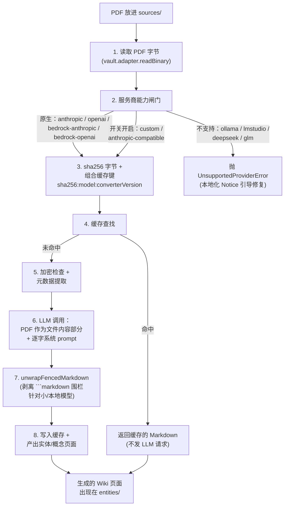

## v1.25.0 带来了什么

PDF 自 v1.25.0 起成为与 Markdown 并列的一级来源格式。把研究论文、手册、扫描件或 400 页合同放进 `sources/` 文件夹，插件就会通过你的 LLM 服务商读取它，经 OCR 风格的逐字转写器转换为 Markdown，再送入与 Markdown 笔记同一条实体/概念/`[[wiki-link]]` 提取流水线。既有的一切——双向链接、跨语言别名、矛盾检测、查询引用——都不需要改动。

转换后的 Markdown 按内容哈希缓存在 `.obsidian/plugins/karpathywiki/pdf-cache/`。缓存键嵌入了转换器版本（`PDF_CONVERTER_VERSION`，定义于 `src/core/pdf-converter.ts`），因此未来的 prompt 升级会自动让旧条目失效。你的 **vault 默认不被修改**——只有一个可选开关会在转换后于源 PDF 旁写入 `<basename>.pdf.md` 旁注文件。

本文带你走一遍 PDF 摄取实际发生的全过程、哪些服务商原生支持、何时打开 `Force PDF Support`、以及如何在 Apple Silicon 上完全离线跑通整条流水线。

## 摄取流水线（按正确性顺序）

PDF 路径与 Markdown 路径一致，只是前面多了一步。**顺序是有意义的**：服务商能力闸门跑在缓存查找之前——这样从 `anthropic` 切换到 `ollama` 的用户不会不知不觉拿到一份现在已不支持的服务商留下的旧缓存。



转换器自身头注释里的四个关键事实（`src/core/pdf-converter.ts`）：

> Architecture（按正确性顺序排列；闸门先于缓存，避免用户从 `anthropic` 切到 `ollama` 时悄悄收到一份已不支持的服务商留下的缓存）：
> 1. 读取 PDF 字节
> 2. 服务商能力闸门（廉价的，必须先于缓存返回执行）
> 3. sha256 字节并组合逻辑缓存键（sha256:model:version）
> 4. 缓存命中 → 返回缓存条目（不发 LLM 请求）
> 5. 缓存未命中 → 加密检查、元数据提取、LLM 调用
> 6. 将 LLM 响应写入缓存

这个顺序是有负载意义的。如果把缓存检查放在闸门之前，那么从 `anthropic` 切到 `ollama` 的用户会看到一份过期的 Anthropic 转换 Markdown，归因于 Ollama 模型——两个维度都错了（服务商错配 + 模型版本漂移）。架构顺序就是用来防这个 bug 的。

## 服务商支持矩阵

闸门使用 `src/constants.ts` 里的两组常量：

| 服务商 | PDF 支持 | 备注 |
|--------|----------|------|
| `anthropic` | ✅ 原生 | Claude 把 PDF 作为文件内容部分读取 |
| `openai` | ✅ 原生 | GPT-4o+ 把 PDF 作为文件内容部分读取 |
| `bedrock-anthropic` | ✅ 原生 | AWS 上的 Claude |
| `bedrock-openai` | ✅ 原生 | AWS 上的 OpenAI |
| `custom` | ⚠️ 需开启 `forcePdfSupport=true` | 用户自担风险 |
| `anthropic-compatible` | ⚠️ 需开启 `forcePdfSupport=true` | 用户自担风险 |
| `ollama` / `lmstudio` / `deepseek` / `glm` | ❌ 永远不支持 | 只能走本地 OCR 路径——见下文 |

切换到原生服务商（`anthropic` / `openai` / `bedrock-*`）会自动把 `forcePdfSupport` 开关重置为 `false`。v1.25.0 删除了 `FORCE_PDF_PROVIDER_IDS` 常量——服务商支持现在通过 `NATIVE_PDF_PROVIDER_IDS ∪ FORCE_PDF_PROVIDER_IDS` 的并集来表达，不再走"每个开关的允许列表"模式。

碰到不支持的服务商时，错误信息会本地化：

> PDF conversion is not supported by provider "ollama". Supported providers: anthropic, openai, bedrock-anthropic, bedrock-openai. For other OpenAI-compatible or Anthropic-compatible providers, enable "Force PDF Support" in Settings → LLM Configuration → Advanced (at your own risk).

"at your own risk"（自担风险）这个措辞是故意的：非原生服务商可能接受 PDF 作为文件部分然后悄悄幻觉内容，也可能直接拒绝请求而没有清晰错误。开关设计为 opt-in 就是出于这个原因。

## 逐字转写器 prompt

PDF → Markdown 系统 prompt（在 `src/wiki/prompts/pdf.ts`）于 v1.25.0 PR3 follow-up #9 重写，以更好地适配小/本地模型。原本的"preserve source, do not summarize"（保留原文，不要总结）对它们太抽象——Qwen3.5-2B 和 Llama 3 8B Instruct 在这条指令下会幻觉。新的"OCR-style verbatim transcriber"（OCR 风格逐字转写器）框架对小模型足够具体，并且包含三个反幻觉标记：

| 标记 | 模型何时输出 |
|------|--------------|
| `[illegible]` | 短语/句子确实读不清 |
| `[figure: brief description]` | 图表无法忠实描述 |
| `[equation: snippet or "unreadable"]` | 数学公式无法干净转写 |

标记方案给了模型一个**明确的、替代猜测的选项**——不必编造看似合理但错误的内容，而是承认这一段是空白。对一个引用必须能追溯到真实内容的研究工作流而言，这是"可用的 Wiki 页面"与"幻觉工厂"的分水岭。

prompt 还显式禁止：

- ` ```markdown ` / ` ``` ` / `<output></output>` 围栏（小模型最爱套的壳）
- "Modernization" 标点或大小写（逐字就是逐字）
- 翻译源语言（转换保留原文语言不变）
- 添加 "Here is the converted Markdown:" 之类的元文本

当小模型即使在 prompt 明确禁止下仍套围栏时——Qwen3.5-2B-MLX-4bit 一直如此——`unwrapFencedMarkdown()` 会在 LLM 调用之后、缓存写入之前清理响应。这是纵深防御：即使 prompt 被忽略，缓存里也只有干净的 Markdown。

## 三层防御的缓存管理

缓存在 `.obsidian/plugins/karpathywiki/pdf-cache/` 下，由三层守卫管理（同样来自 v1.25.0）：

1. **单条目上限（10 MB）**：写前检查，超过 10 MB 一律拒绝
2. **LRU 按 mtime 淘汰（总 100 MB / 1000 条）**：写后检查，目录超限时淘汰最旧条目
3. **`prepareBatchIngest()`**：TTL 清理 + 大小执行，插件加载时与每次批量摄取开始时执行

物理文件名是 `sha256(logicalKey).slice(0, 16)`——16 个十六进制字符，Git 短哈希风格。逻辑键保留 `sha256:model:converterVersion` 语义，方便调试时阅读。这种双层方案避开了直接使用模型名作为文件名时的跨平台问题（Windows 拒绝文件名里的 `/` 和 `:`）。

## 可选的 vault 旁注

默认情况下，PDF 转换是**只缓存**的：你的 vault 会得到新的 Wiki 页面（`entities/<X>.md`、`concepts/<Y>.md` 等），但源 PDF 不会被修改。转换后的 Markdown 只存在于缓存中。

如果你想在 vault 里保留一份永久的 PDF Markdown 版本——比如跨转换内容做 grep、分享给其他工具、或在图谱视图里看见转换结果——打开 **Settings → Wiki Configuration → Wiki Folder → Write PDF Markdown to Vault**。之后每次成功转换，插件会在源 PDF 旁写入 `<basename>.pdf.md` 旁注文件。旁注内容与缓存中存储的完全一致。

v1.25.0 我们**没有**默认开启这个开关。早期的草稿默认开启；评审时意识到，`sources/` 里有 200 个 PDF 的用户一觉醒来会发现 vault 多了 200 个新文件。只缓存的默认符合"最少惊讶"原则——文件系统只在你要求时增长。

## Apple Silicon 完全离线的 PDF 路径

如果你的隐私姿态或网络情况要求 PDF 永不离开本机，v1.25.0 推荐的配置是：

```
┌─────────────────────────────────────────────────┐
│ 服务商： Custom OpenAI-Compatible               │
│ Base URL：http://localhost:1234/v1（oMLX）       │
│ API 密钥：（空——LM Studio / oMLX 不需要）       │
│ 模型：   <你的本地模型>                          │
│ Force PDF：☑ 启用（在 Advanced 下）              │
└─────────────────────────────────────────────────┘
```

Apple Silicon 上的技术栈：

- **[oMLX](https://github.com/jundot/omlx)**——针对 M 系列芯片原生 MLX 支持的 OpenAI 兼容本地服务器
- **Markitdown** 后端——把 PDF 作为文件内容部分喂给本地模型
- **Baidu Unlimited-OCR**——OCR 模型。2026-06-22 开源。3B 总参数 / 0.5B 激活参数；之所以选它，是因为它解决了旧 OCR 模型在长文档上"生成越长越慢"的失效模式

把 oMLX 作为 `Custom OpenAI-Compatible` 服务商接入，开启 `Force PDF Support`，整条转换就在本机完成。插件并不知道也不关心转换是本地的——缓存哈希一样、淘汰规则一样、随后产出的 Wiki 页面一样。从插件视角，这只是另一个服务商。

至于把 Markdown 转成 Wiki 页面的 LLM 那一步（实体抽取），把本地 OCR 配 Ollama 或 LM Studio 上的本地对话模型即可。整条流水线完全不发出任何出站网络流量。v1.25.0 的三层防御缓存保证你不会在反复摄取中重复付转换代价。

## 何时打开 Force PDF Support

这个开关是为了原生列表之外、但**可能**接受 PDF 作为文件部分的那一大长尾服务商设计的。下面这些情形打开它是合理的：

- **Custom OpenAI-Compatible 端点**，跑的是你控制或信任的模型
- **Anthropic-compatible 端点**（自托管的 Claude API 镜像）
- **OpenRouter 路由模型**，上游服务商恰好支持 PDF，但 OpenRouter 接口没有声明

下面这些情形**不要**打开：

- 服务商直接拒绝请求（反正你会看到清晰错误，不需要开关）
- 服务商接受但转换质量差（小模型 + 长 PDF）
- 你不确定服务商是真透传还是会记录你的 PDF

错误分类器 `isPdfRelatedLlmError`（在 `src/core/pdf-converter.ts`）在标记为"服务商不支持 PDF"之前**必须同时**满足：拒绝动词（`reject` / `not support` / `unsupported` / `invalid` / `not allowed`）+ PDF/媒体标记（`pdf` / `application/pdf` / `file part` / `mediatype`）。v1.25.0 之前分类器只在 `'pdf'` 上做子串匹配，导致 413 大小错误和 Rust-serde "unknown variant `file`" 模式拒绝被误判为"服务商不支持 PDF"——已在 PR #302 修复。

## 常见失败模式

至少会碰到一次的三个模式，以及对应的修法：

**1. "PDF is encrypted"。** v1.25.0 不能解密加密 PDF。提前解密（macOS 用 Preview，Linux 用 qpdf，或在会把加密展平的阅读器里"打印为 PDF"）。我们刻意不内置解密库——威胁模型不清晰，悄悄解密会让处理机密文件的用户感到意外。

**2. "PDF is image-only"。** 没有文字层的扫描 PDF。Apple Silicon 上的 OCR 路径能处理；云服务商那边，LLM 的原生 PDF 支持也通过 OCR 读图像。转换会比文字原生 PDF 更慢、保真度更低；预算上要留余地。

**3. 缓存命中但内容错。** 如果你看到的 Markdown 与当前 PDF 不匹配，是转换器版本 bump 了（prompt 升级），缓存没失效。手动跑 `prepareBatchIngest()`，或者直接删 `.obsidian/plugins/karpathywiki/pdf-cache/` 下的相关缓存文件。下次摄取会重建。

## 进一步阅读

- `src/core/pdf-converter.ts`——完整的 PDF → Markdown 转换器（约 200 行）。服务商闸门、缓存键组合、错误类。
- `src/core/pdf-cache.ts`——v1.25.1 抽离出来的 `DiskCache<T>` 抽象，附带 PDF 专用条目格式。
- `src/wiki/prompts/pdf.ts`——逐字系统 prompt 与 `unwrapFencedMarkdown()` 助手。
- `src/core/pdf-metadata.ts`——加密检测、信息字典解析、页数提取。
- v1.25.0 release notes——完整的服务商、设置、CLI 标志列表。

如果你要批量摄取学术 PDF 并想把它与 Zotero 串联，看 [实践指南（6）：Zotero → Obsidian → Wiki，学术文献流水线](/zh/blog/posts/zotero-pdf-integration/)。要选一个能在你硬件上扛得住 PDF 转换的模型，看 [入门必读（5）：选一个真正跑得动你 Wiki 的本地模型](/zh/blog/posts/choosing-local-models/)。