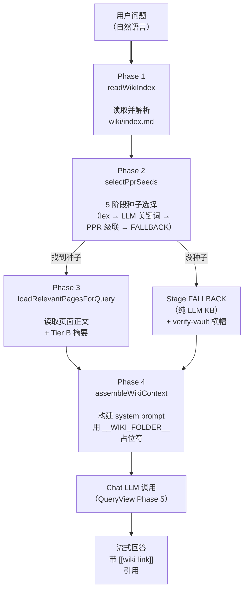
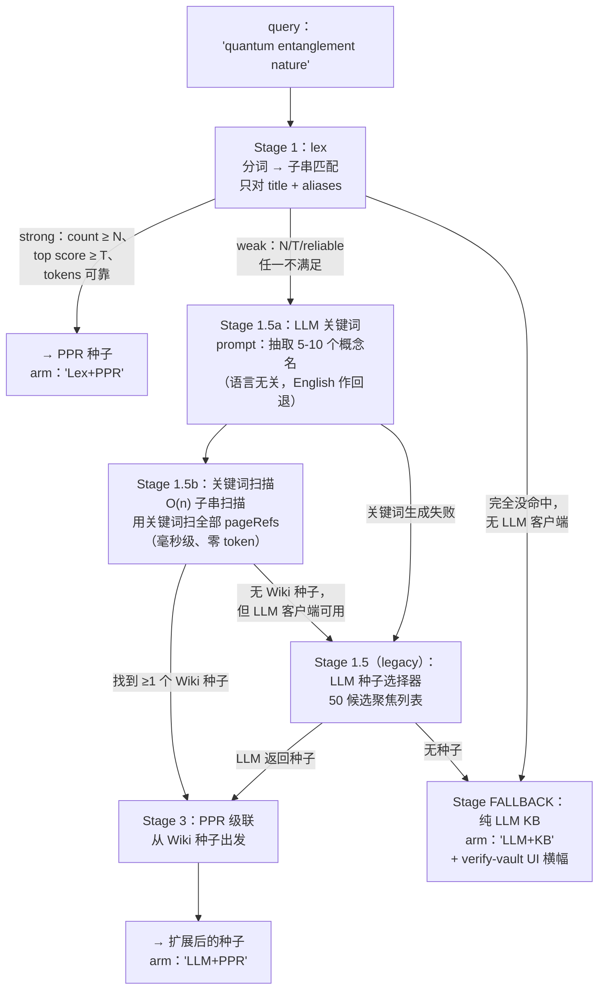

这是 *Inside the System* 系列的第七篇。前几篇走过模块化架构、模型选择、摄入延迟、矛盾检测、Schema 提取，以及驱动检索的蒙特卡洛 PPR 引擎。本篇打开查询侧的引擎盖——把用户的自然语言问题变成一条 Wiki 锚定、带引用的答案的四阶段流水线。

如果你只想看面向用户的故事，请读 [Announcement: v1.24 — Per-Task Models + Query Engine Refactor](/zh/blog/posts/v123-graph-engine-ai-sdk/)。本文假设你愿意在一个被重构过的 1,000 行模块里待上 15 分钟。

## 四阶段形态

`QueryView.buildWikiContext` 被拆成四个流水线阶段（位于 `src/wiki/query-engine/pipeline/`）：



四个 phase 加上 chat-LLM 调用（Phase 5）构成完整的查询流水线。每个 phase 都是 `src/wiki/query-engine/pipeline/` 下的一个纯模块——最大的 165 行，最小的不到 50 行。PR #250 的拆分把曾经 1,373 行的 `query-engine.ts` 神函数拆掉。

有意思的设计决策都集中在 **Phase 2**——它本身又是一个五阶段流水线。这是流水线与普通 RAG 系统分歧最大的地方。

## Phase 2 详解：五阶段种子选择器

当用户问"量子纠缠的本质"时，插件怎么找到对的页面？它跑过五个阶段——每个都是下一阶段的兜底：



三个 arm 标签会在 UI 里展示——`Lex+PPR`、`LLM+PPR`、`LLM+KB`——用户始终知道是哪些阶段贡献了答案。`Lex++PPR` 变体覆盖罕见情形：lex 弱、关键词扫描没结果，但 lex top-K 仍被当作 PPR 的最后兜底种子。

**5 阶段形态是这条流水线的核心设计决策。** 为什么是五个阶段而不是一个？

## 它是什么，不是什么

先老实交底：这不是教科书意义上的 RAG。标准 RAG 流程是：

1. 把 query 嵌入向量
2. 与 chunk 嵌入做向量相似度检索
3. Top-K chunks 进 prompt
4. LLM 用 chunks 当上下文回答

我们一个都没做。我们不嵌入 query、没有向量存储、不按相似度抓 chunk。我们有的是：

- `[[wiki-link]]` 图谱（摄入时构建，wiki 文件夹变化时惰性重建）
- 确定性的页面索引（`wiki/index.md`），列出每页的 path、title、aliases、summary
- Wiki-link 图上的个性化 PageRank（PPR）——算法见 [深入解析（6）：蒙特卡洛 PPR](/zh/blog/posts/monte-carlo-ppr/)

所以这是什么系统？

**它是图锚定的检索流水线，不是向量检索流水线。** Wiki 自身的结构——什么链接到什么——是检索信号。LLM 的角色是解释与综合，不是搜索。

这个区别很重要，因为**图信号和嵌入信号犯不同的错**。在 2,000 页的 vault 上做嵌入检索，可能召回**语义相关但用户 Wiki 从未链接到**的页面——按相似度为真但**结构上无关**。图检索召回用户自己的知识图谱标记为相连的页面——**结构上相关但语义上可能令人惊讶**。在"对一个个人 Wiki 而言什么算相关"这个问题上，两者是一种立场选择。

## 五个与普通 RAG 分道的设计选择

### 1. Lex-然后-PPR 在中小规模胜过向量-然后-rerank

~2,000 页以下的 Wiki，lex-first 级联比嵌入检索更快更准：

- **零嵌入成本**：Stage 1 零 LLM token、零向量存储 IO
- **无冷启动问题**：lex 在页面存在的瞬间就能工作；嵌入需要预摄入步骤
- **确定性**：同一 query → 同一 Stage 1 命中 → 同一 Stage 3 PPR 种子 → 同一 top-K
- **可解释**：能给用户展示哪些 lex token 命中了哪些 title

代价在规模化时出现。过了约 5,000 页，lex 开始返回太多弱命中，真实向量存储才有帮助。我们考虑过把嵌入检索作为 Stage 0（lex 之前）加入；v1.23.0 的设计评审讨论过、否决了，因为 2,142 页真实库上经验 R@5 是 23.8%——和同一库上 bge-m3 嵌入的差距落在采样噪声内（见 v1.23 release notes）。在 2K 页这一规模，cascade 的 lex 路径好到加嵌入等于白搭。

**这不是永久判决。** v1.24 设计讨论里有显式的 **"source-revision awareness"** 工作流；嵌入增强在 v1.25+ 路线图上是 opt-in。真要加，会作为 Stage 0（冷启动检索，在 Stage 1 lex 之前）——不是替换 cascade。

### 2. 五个阶段，让 LLM 增强永不阻塞热路径

RAG 系统的常见模式是"总是先调 LLM 做 query 理解，再做向量搜索"。这是浪费：90% 的 query 是 lex 能直接处理的简单词条。

我们的 Stage 1 lex **不调任何 LLM**。只有 lex **弱**（count 低于阈值、top score 低于阈值、tokens 不可靠）时，才升级到 Stage 1.5a（LLM 关键词生成）。这意味着：

- 像 "January 2026 meeting" 这种 query，命中 Stage 1、找到 4 个强 lex 匹配，从不为 query 理解调 LLM
- 像 "what's that concept about X" 这种 query，Stage 1 弱命中（X 不是字面 title），升级到 Stage 1.5a，拿到关键词，扫描，找到种子，跑 PPR

"不必调 LLM 就不调"原则让热路径又快又便宜。昂贵的阶段（1.5a、1.5 legacy）只在便宜阶段失败时才跑。

### 3. 本地子串扫描 > LLM 50 候选消歧

这是最微妙的设计选择，值得仔细走一遍。**v1.23.0 的老设计**：

```
LLM 种子选择器：发送 query + 50 个候选（path, title, summary）→ LLM 选最多 3 个
```

真实使用中暴露了一个 bug：当用户问的概念住在 vault 第 1,410 行时，LLM 根本看不到它，因为候选列表是从 `pageRefs[0..50]` 切片来的。相关页面根本没在输入里。

**v1.24.1 的修法**倒置了结构：

```
LLM 关键词生成：从 query 抽取 5-10 个概念名
本地子串扫描：用这些关键词 O(n) 扫全部 pageRefs（零 token）
```

为什么这样可行：

- **LLM 抽取概念，不是做匹配。** LLM 不需要看到候选就知道用户在问什么。"量子纠缠的本质" → keywords `["量子纠缠", "quantum entanglement", "entanglement", "量子", "quantum"]`。
- **本地扫描是穷举的。** vault 里每一页都查，不只是 wiki 内部顺序的前 50。住在第 1,410 行的页面现在可达。
- **零 token 成本。** 扫描在约 2,000 个 pageRefs 上 O(n)。每个 pageRef 是 title + aliases（约 50 字符）。扫描毫秒级完成。
- **语言无关。** 关键词 prompt（在 `query-keywords.ts` 里）显式语言无关——LLM 自动检测 query 的主语言，输出**该语言 + English** 的关键词（English 作为 i18n Wiki 跨语言搜索的通用回退）。硬编码"中文 ↔ 英文"会破坏日语 / 韩语 / 法语为母语的用户。

v1.24.1 之前的 bug 在 PR #260 的 Tier-1+Tier-2 合并分诊和 v1.24.1 PATCH Phase 5.5.0/5.5.1 里修掉。完整审计跟踪在 `src/core/ppr-cascade.ts` 和 `src/wiki/query-engine/pipeline/query-keywords.ts`。

### 4. `pureLLM` 是一等状态，不是悄悄兜底

Stage FALLBACK 路径——当 lex、关键词扫描、LLM 种子选择器都没找到 Wiki 相关页面——返回我们称为 **`pureLLM`** 的回答模式：

- 告诉 chat LLM："未找到相关页面；从通用知识作答"
- UI 显式展示 **"verify-vault" 横幅**，让用户看到这个答案**没有** Wiki 背书
- 答案不带引用（没有源页面可引）

这是经过深思的选择。另一种做法——悄悄让 LLM 答、不标记缺少 Wiki 背书——会教用户"问 Wiki"等于"得到自信但无根据的答案"。这是 RAG 系统侵蚀用户信任的方式：通过不区分答案是有据还是编造。

`pureLLM` 标志也反馈回 cascade 以供观测：如果高比例 query 落到 `pureLLM`，是 Wiki 内容没覆盖用户问的话题的信号——对用户有用（对未来的摄入决策也有用）。

### 5. Chat prompt 不包含完整 Wiki 索引

这是最反直觉的设计选择。标准 RAG 在规模化下的失效模式是"top-K chunks 加系统指令超出上下文窗口"。修法通常是更好的嵌入 + chunking。

我们走了另一条路：**chat prompt 里完全不放 Wiki 索引**。取代的是一个紧凑的 `pageSummaryHint`：

```
- entities/Foo — Foo | aliases: Foo Corp / FOO
- concepts/Bar — Bar | aliases: bar theory
- sources/qux — Qux paper | aliases: qux-2026
```

这只有 **path + title + aliases**——从 `pageRefs` 派生。Chat LLM 看到 Wiki 里有啥页面（于是能说"我不知道 Baz，因为 Baz 不在你的 Wiki 里"），又不用看大段的完整 summary 文本。

v1.24.1 之前，prompt 包含整个 `wiki/index.md` 文本——2,137 页 vault 上是 70K token。Phase 5.5.0 PATCH 把这部分移掉了：

> 转换后的 Markdown 已经给了 LLM 所需的内容；可选的 `pageSummaryHint`（从 pageRefs 派生的紧凑 path/title/aliases 列表）由 caller 决定是否传入，让 LLM 知道没被检索到的页面。Wiki 结构由已加载的页面和 entity/concept/source 文件夹约定隐含。

70K token 的节省对免费档用户（8K–32K 上下文窗口）尤其重要。他们现在可以无截断幻觉地使用插件。

### 彩蛋 6. `__WIKI_FOLDER__` 占位符防止过期文件夹泄漏

v1.24.0 撞到的隐性 bug（Bug C 3.0）：chat LLM 被要求用用户当前的 `settings.wikiFolder` 渲染 `[[wiki-link]]` 路径。如果我们把真实文件夹烤进 prompt，用户的聊天历史又持久化了那个 prompt（和 LLM 用渲染过路径的响应），LLM 就会在后续 prompt 里复用那些路径——**即便用户改了 `wikiFolder`**。

修法：system prompt 里到处用字面占位符 `__WIKI_FOLDER__`。渲染时（`thinking-extract.ts`）用**当前**文件夹替换占位符，仅用于显示。LLM 永远看不到字面文件夹，所以永远不会把某个烤进行为。

这种 bug 在你改设置之前都不可见——一改就把答案毁掉。占位符修法就一行，但永远受益。

## 成本与延迟，经验值

2,000 页 vault 上的典型 query：

| 阶段 | 延迟（典型） | LLM tokens | 备注 |
|------|------------:|----------:|------|
| Phase 1：readWikiIndex | 5–15 ms | 0 | 文件读 + 解析 |
| Stage 1：lex | 1–3 ms | 0 | 纯子串扫描 |
| Stage 1.5a：LLM 关键词 | 200–800 ms | 50–150 | 仅在 Stage 1 弱时 |
| Stage 1.5b：关键词扫描 | 1–5 ms | 0 | O(n) over pageRefs |
| Stage 3：PPR cascade | 30–80 ms | 0 | 蒙特卡洛，K=3000 L=20 |
| Phase 3：loadPages | 50–200 ms | 0 | IO 绑定 |
| Phase 4：assemble | 1–5 ms | 0 | 纯模板构建 |
| Phase 5：chat LLM | 1–4 s | 2–8K | 流式输出 |

"强 lex" query（比如 "January 2026 meeting"）：chat LLM 之前总时 ≤300 ms。PPR 即使 K=3000 步也在 <80 ms 内跑完。

"弱 lex，LLM 关键词" query：Stage 1.5a 加 200–800 ms，但只在必要时。

"纯 LLM KB" 兜底：跳过 PPR，直接带着 `pureLLM=true` 标志进 chat。

所有延迟**人感知即瞬时**，除了 chat LLM 调用——这无论如何都不可避免。

## 这个设计放弃了什么

老实的取舍清单：

- **没有语义相似度。** 一页提到 "feline" 不会匹配 query "cat"，除非这页有对应 alias。嵌入能桥这个；我们不。
- **没有跨语言语义。** 中文 query 找只有英文的页面需要显式的跨语言 alias。嵌入能自动桥；我们不。
- **没有 chunk 级检索。** 页面是原子的。如果长页面里只有一节相关，你拿到整页（截到 MAX_PAGE_CONTENT_CHARS）。chunk 嵌入能帮；我们不。
- **Lex 会错过习惯表达。** "what's that thing about X" 这种 query 弱命中 Stage 1；只有 LLM 关键词阶段能救。

这些是**真实的局限**，不是理论上的。在用户自己写的个人 Wiki 上，这种偏见常常是对的——但在多人 Wiki 或自然语言措辞差异大的领域，嵌入会是严格胜利。

路线图（Discussion #246）覆盖 opt-in 嵌入增强作为 Stage 0。它会是 **opt-in** 而非默认，因为 lex-PPR cascade 够快、确定性、零 token——在精心维护的个人 Wiki 上，准确性边际收益小。

## 这对用户意味着什么

如果你读到这里，要点就是：**Query Wiki 给你的答案，在结构上对"它知什么不知什么"是诚实的。** arm 标签（`Lex+PPR`、`LLM+PPR`、`LLM+KB`）、`pureLLM` 标志、verify-vault 横幅、`__WIKI_FOLDER__` 占位符——这些不是工程卫生。是让个人 Wiki 感觉像 Wiki 而不是穿着戏服的聊天机器人的设计选择。

插件的立场：你的 Wiki 结构是真相之源。LLM 是解释者。PPR 是导航者。嵌入是等它们自己付得起代价时的可选增强。

如果你想读某一块的更深入内容：

- PPR 算法：[深入解析（6）：蒙特卡洛 PPR](/zh/blog/posts/monte-carlo-ppr/)
- 用 PPR 做 Hub 识别：`src/core/hub-detection.ts`
- PPR cascade 的三档：`src/core/ppr-cascade.ts`
- 种子选择器的五个阶段：`src/wiki/query-engine/pipeline/select-seeds.ts`
- 关键词生成 prompt：`src/wiki/query-engine/pipeline/query-keywords.ts`
- 占位符修法：`src/wiki/query-engine/pipeline/assemble-context.ts`（Bug C 3.0）
- v1.24 release notes：`core/model-resolver.ts` 里的每个调用站点的模型解析

v1.24.0 PATCH（Phase 5.5.0 和 5.5.1）让这条流水线在规模化下可信。五阶段形态让它快。`pureLLM` 的诚实让它值得用。