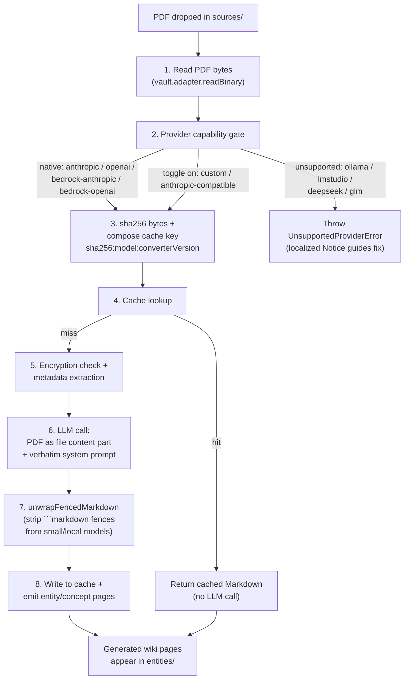

## What changed in v1.25.0

PDFs are now a first-class source format alongside Markdown in `sources/`. Drop a research paper, manual, scanned receipt, or 400-page contract into your sources folder and the plugin reads it through your LLM provider, converts it to Markdown via an OCR-style verbatim transcriber, and feeds the result into the same entity / concept / `[[wiki-link]]` extraction pipeline as your Markdown notes. Every existing feature — bidirectional links, cross-language aliases, contradiction detection, query citations — applies unchanged.

The converted Markdown is content-hash cached in `.obsidian/plugins/karpathywiki/pdf-cache/`. The cache key embeds the converter version (`PDF_CONVERTER_VERSION` in `src/core/pdf-converter.ts`), so any future prompt upgrade invalidates stale entries automatically. Your vault is **not modified by default** — there is a single opt-in toggle that writes a `<basename>.pdf.md` sidecar next to the source PDF after conversion.

This post walks through what actually happens during a PDF ingest, which providers support it natively, when to flip on `Force PDF Support`, and how to run the entire pipeline fully offline on Apple Silicon.

## The ingest pipeline (correctness-ordered)

The PDF path mirrors the Markdown path with one extra stage at the front. The order matters: the provider capability gate runs **before** the cache lookup so a user who switches from `anthropic` to `ollama` cannot silently receive a cached conversion from a now-unsupported provider.



The four key facts from the converter's own header comment (`src/core/pdf-converter.ts`):

> Architecture (correctness-ordered; provider gate precedes cache lookup so a user who switches from `anthropic` to `ollama` cannot silently receive a cached conversion from a now-unsupported provider):
> 1. Read PDF bytes
> 2. Provider capability gate (cheap, must run before cache return)
> 3. sha256 the bytes + compose logical cache key (sha256:model:version)
> 4. Cache hit → return cached entry (no LLM call)
> 5. Cache miss → encryption check, metadata extract, LLM call
> 6. Write LLM response to cache under the file token

The order is load-bearing. If you move the cache check before the provider gate, a user who flips their provider from `anthropic` to `ollama` will see a stale Anthropic-converted Markdown attributed to the Ollama model — wrong on two axes (provider mismatch, model-version drift). This is the bug the architectural order prevents.

## Provider support matrix

The provider gate uses two constant sets from `src/constants.ts`:

| Provider | PDF Support | Notes |
|----------|-------------|-------|
| `anthropic` | ✅ Native | Claude reads PDFs as file content parts |
| `openai` | ✅ Native | GPT-4o+ reads PDFs as file content parts |
| `bedrock-anthropic` | ✅ Native | AWS-hosted Claude |
| `bedrock-openai` | ✅ Native | AWS-hosted OpenAI |
| `custom` | ⚠️ With `forcePdfSupport=true` | User accepts the risk |
| `anthropic-compatible` | ⚠️ With `forcePdfSupport=true` | User accepts the risk |
| `ollama` / `lmstudio` / `deepseek` / `glm` | ❌ Never | Local OCR path only — see below |

Switching to a native provider (`anthropic` / `openai` / `bedrock-*`) auto-resets the `forcePdfSupport` toggle to `false`. The `FORCE_PDF_PROVIDER_IDS` constant was deleted in v1.25.0 — provider support is now expressed through the union of `NATIVE_PDF_PROVIDER_IDS ∪ FORCE_PDF_PROVIDER_IDS`, not via a per-toggle allowlist.

When you hit an unsupported provider, the error message is locale-aware:

> PDF conversion is not supported by provider "ollama". Supported providers: anthropic, openai, bedrock-anthropic, bedrock-openai. For other OpenAI-compatible or Anthropic-compatible providers, enable "Force PDF Support" in Settings → LLM Configuration → Advanced (at your own risk).

The "at your own risk" phrasing is deliberate: a non-native provider may accept the PDF as a file part and silently hallucinate the contents, or it may reject the request without a clear error. The toggle is opt-in for that reason.

## The verbatim transcriber prompt

The PDF → Markdown system prompt (in `src/wiki/prompts/pdf.ts`) was rewritten in v1.25.0 PR3 follow-up #9 to favor small/local models. The original "preserve source, do not summarize" framing was too abstract — Qwen3.5-2B and Llama 3 8B Instruct would fabricate under it. The new framing — "OCR-style verbatim transcriber" — is concrete enough for small models to follow, and includes three anti-hallucination markers:

| Marker | When the model emits it |
|--------|-------------------------|
| `[illegible]` | A phrase / sentence is genuinely unreadable |
| `[figure: brief description]` | A figure or chart cannot be faithfully described |
| `[equation: snippet or "unreadable"]` | A math equation cannot be cleanly transcribed |

The marker approach gives the model an **explicit alternative to guessing** — instead of inventing plausible-but-wrong text, it acknowledges the gap. For a research workflow where citations need to trace back to actual content, this is the difference between a usable wiki page and a hallucination factory.

The prompt also explicitly forbids:

- ` ```markdown ` / ` ``` ` / `<output></output>` fences (wraps that small models love)
- "Modernization" of punctuation or casing (verbatim means verbatim)
- Translation of the source language (the conversion preserves the original language exactly)
- Adding meta-text like "Here is the converted Markdown:"

When a small model still wraps output in fences despite the prompt — Qwen3.5-2B-MLX-4bit does this consistently — `unwrapFencedMarkdown()` cleans the response after the LLM call but before cache write. This is the defense-in-depth: even if the prompt is ignored, the cache only stores clean Markdown.

## Three-defense cache housekeeping

The cache lives in `.obsidian/plugins/karpathywiki/pdf-cache/` and is governed by three guards (also from v1.25.0):

1. **Single-entry cap (10 MB)**: pre-write check, refuses entries larger than 10 MB
2. **LRU-by-mtime eviction (100 MB total / 1000 entries)**: post-write check, evicts oldest entries when the directory exceeds the cap
3. **`prepareBatchIngest()`**: TTL purge + size enforce, runs on plugin load and at the start of every batch ingest

Physical filenames are `sha256(logicalKey).slice(0, 16)` — 16 hex chars, Git short-hash style. The logical key retains `sha256:model:converterVersion` semantics for readability during debugging. This two-layer scheme avoids the cross-platform issues with using raw model names (Windows rejects `/` and `:` in filenames).

## The opt-in vault sidecar

By default, PDF conversion is **cache-only**: your vault gets new wiki pages (`entities/<X>.md`, `concepts/<Y>.md`, etc.) but the source PDF is not modified. The converted Markdown lives only in the cache.

If you want a permanent Markdown version of the PDF in your vault — for example, to grep across converted content, to share with another tool, or to make the conversion visible in Graph View — flip on **Settings → Wiki Configuration → Wiki Folder → Write PDF Markdown to Vault**. The plugin then writes a `<basename>.pdf.md` sidecar next to the source PDF after each successful conversion. The sidecar's content is identical to what the cache stores.

We deliberately did not flip this on by default in v1.25.0. The earlier draft had sidecar-by-default; in review we realized a user with 200 PDFs in `sources/` would wake up to 200 new files in their vault. The cache-only default respects the "least surprise" principle — your filesystem grows only when you ask it to.

## Fully-offline PDF path on Apple Silicon

If your privacy posture or network situation requires that PDFs never leave your machine, the recommended setup as of v1.25.0 is:

```
┌─────────────────────────────────────────────────┐
│ Provider:  Custom OpenAI-Compatible             │
│ Base URL:  http://localhost:1234/v1 (oMLX)      │
│ API key:   (empty — LM Studio/oMLX accept none)│
│ Model:     <your local model>                   │
│ Force PDF: ☑ Enabled (under Advanced)           │
└─────────────────────────────────────────────────┘
```

The stack on Apple Silicon:

- **[oMLX](https://github.com/jundot/omlx)** — an OpenAI-compatible local server with first-class MLX support on M-series chips
- **Markitdown** backend — feeds PDF as a file content part to your local model
- **Baidu Unlimited-OCR** — the OCR model. Open-sourced 2026-06-22. 3B total / 0.5B active parameters; chosen because it solves the "slower the longer it generates" failure mode that plagues older OCR models on long documents

Connect oMLX as a `Custom OpenAI-Compatible` provider, enable `Force PDF Support`, and the entire conversion runs on-device. The plugin does not know or care that the conversion is local — the cache hash is the same, the cache eviction rules are the same, the wiki page generation that follows is the same. From the plugin's perspective, this is just another provider.

For the LLM side of entity extraction (the step that turns Markdown into wiki pages), pair the local OCR with a local chat model via Ollama or LM Studio. The whole pipeline then runs without any outbound network traffic. The cache guarantee from v1.25.0's three-defense housekeeping ensures you don't repeatedly pay the conversion cost across re-ingests.

## When to enable Force PDF Support

The toggle exists for the long tail of providers that aren't on the native list but might still accept a PDF as a file part. Concrete cases where flipping it on is reasonable:

- **Custom OpenAI-compatible endpoint** running a model you control or trust
- **Anthropic-compatible endpoint** (a self-hosted Claude API mirror)
- **OpenRouter routed model** that the upstream provider happens to support PDF on, but the OpenRouter interface doesn't declare

When to **not** flip it on:

- The provider rejects the request (you'll see a clear error anyway — no need for the toggle)
- The provider accepts but the conversion quality is degraded (small models on long PDFs)
- You're not sure whether the provider is a true passthrough or a proxy that might log your PDF

The error classifier `isPdfRelatedLlmError` (in `src/core/pdf-converter.ts`) requires **both** a rejection verb (`reject` / `not support` / `unsupported` / `invalid` / `not allowed`) **and** a PDF/media marker (`pdf` / `application/pdf` / `file part` / `mediatype`) before flagging the error as provider-PDF-mismatch. Pre-v1.25.0 the classifier substring-matched on `'pdf'` alone, which misreported 413 size errors and Rust-serde "unknown variant `file`" schema rejects as "provider doesn't support PDF" — fixed in PR #302.

## Common failure modes

Three patterns you'll hit at least once, with how to fix each:

**1. "PDF is encrypted"**. v1.25.0 cannot decrypt encrypted PDFs. Decrypt in advance (Preview on macOS, qpdf on Linux, or print-to-PDF in a viewer that flattens encryption). We chose not to ship a decryption library — the threat model is unclear, and silent decryption would surprise users with confidential documents.

**2. "PDF is image-only"**. A scanned PDF with no text layer. The OCR path on Apple Silicon handles this; on cloud providers, the LLM's native PDF support also reads images via OCR. The conversion will be slower and lower fidelity than a text-native PDF; budget accordingly.

**3. Cache hit but wrong content**. If you see Markdown that doesn't match the current PDF, your converter version bumped (a prompt upgrade) but the cache didn't invalidate. Run `prepareBatchIngest()` manually, or just delete the relevant cache file under `.obsidian/plugins/karpathywiki/pdf-cache/`. The next ingest will rebuild.

## Where to read more

- `src/core/pdf-converter.ts` — the full PDF → Markdown converter (~200 LOC). Provider gate, cache key composition, error classes.
- `src/core/pdf-cache.ts` — the `DiskCache<T>` abstraction extracted in v1.25.1, with the PDF-specific entry format.
- `src/wiki/prompts/pdf.ts` — the verbatim system prompt and `unwrapFencedMarkdown()` helper.
- `src/core/pdf-metadata.ts` — encryption detection, info-dict parsing, page count extraction.
- v1.25.0 release notes — full list of providers, settings, and CLI flags.

If you're ingesting a large batch of academic PDFs and want to chain this with Zotero, see [Workflow Guide (6): Zotero to Obsidian to Wiki](/blog/posts/zotero-pdf-integration/). For picking a model that handles PDF conversion well on your hardware, see [Getting Started (5): Picking a Local Model That Actually Fits Your Wiki](/blog/posts/choosing-local-models/).