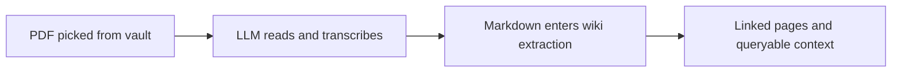

## The PDFs sitting beside your vault

A typical research week produces a folder full of papers. The introduction of one explains a mechanism that appears in another. A figure in the third contains the result that everyone keeps citing. A table in the fourth has the numbers needed for next week's analysis. The researcher points Obsidian at those PDFs and discovers that, from the vault's point of view, they are still just sealed envelopes.

Markdown notes are searchable, linkable, and pleasant to edit. PDFs are none of those things in quite the same way. You can search a text-native paper, but the result is often a page number without the surrounding argument. You can copy a paragraph, but the table comes across as a mangled sequence of tabs. Figures remain pictures with no useful description. A scanned paper may not contain selectable text at all. The usual workaround is a small ritual of misery: open the PDF, copy a passage, clean it up, create a note, add links by hand, then repeat until the next paper wins your attention.

This is especially frustrating in a personal wiki because the valuable part of a paper is rarely the paper's existence. It is the relationship between a method, a result, a person, a dataset, and the questions already in your notes. A PDF that stays an attachment cannot participate in those relationships. It can be stored, but it cannot really join the conversation your vault is trying to have with you.

That is the problem PDF ingest is meant to solve.

## PDFs are now sources, not attachments

With v1.25.0, PDFs became a first-class source format for Karpathy LLM Wiki. Pick a paper, book chapter, manual, receipt, or contract from anywhere in your vault, and the plugin treats it as source material alongside your Markdown notes. It asks your configured model to turn the document into readable Markdown, then sends that Markdown through the same wiki-making process used for notes: entities, concepts, aliases, links, contradictions, and query citations all work the same way.

The important change is not that the plugin can “read a PDF.” Plenty of software can extract text from a PDF. The important change is that the extracted document enters the existing knowledge pipeline instead of stopping at a one-off text dump. The paper can become part of the graph. A concept mentioned in its methods section can connect to a note you wrote six months ago. A person in the references can resolve to an entity page. A later question can cite the resulting wiki content rather than asking you to remember which of fifty browser tabs contained the answer.

There is no special PDF vault and no second kind of wiki page to learn. You pick the source, let the conversion happen, and then work with the pages that the normal pipeline produces.

## What actually happens to a PDF

The flow is deliberately less magical than the user interface can make it look. First, the configured LLM receives the PDF in a format it knows how to inspect. It reads the pages, including text and, where supported, the visual material. The model is asked to transcribe rather than summarize: preserve the document's wording, order, headings, tables, and useful visual details in Markdown.

That Markdown is an intermediate representation, not the final product. Once it exists, the PDF has crossed the format boundary. From there it takes the ordinary route through the wiki extractor. The model identifies entities and concepts, proposes links, and generates the pages that make the material useful in the vault.



This two-model-shaped distinction matters even when the same model performs both jobs. PDF conversion asks, “What is actually on this page?” Wiki extraction asks, “What should this material connect to in the user's knowledge base?” A summary can be excellent and still be the wrong input for the second question because it has discarded the footnote, qualification, table row, or awkward detail that makes a connection traceable.

We therefore keep conversion and extraction conceptually separate. The first pass is conservative transcription. The second pass can be interpretive, because interpretation is where links and concepts become valuable. If the first pass invents a sentence, every later page inherits that invention with a very convincing appearance of provenance. Keeping the boundary clear is one of the small design decisions that makes the whole workflow more trustworthy.

## The provider reality

The first question most people have is not “How is the cache keyed?” It is “Will this work with the model I already pay for?” The honest answer is: it depends on whether your provider supports PDFs as native document input, rather than merely accepting an OpenAI-shaped request.

If you use Anthropic Claude or OpenAI with a GPT-4o-class model or newer, PDF ingest should work without a special switch. Those providers understand a PDF as a document, not just as an arbitrary binary attachment. The Bedrock variants for Claude and OpenAI are also in the native group. In those cases, pick the PDF from your vault, choose the provider you normally use, and let the normal ingest flow run.

The word “native” is doing useful work here. A provider may advertise an OpenAI-compatible API while implementing only the text and image parts of that API. It may accept the request body and then reject the document field, ignore the file, or pass it to a model that was never trained to inspect PDFs. The request can look perfectly valid from the plugin's perspective and still produce a bad conversion. Native support means the provider's document path is an intended capability of the model service, not merely a lucky coincidence in the wire format.

Here is the short version. The first column is the provider family you select in the plugin. The second says what you should expect before touching advanced settings. “Native” means start normally. “Force” means the provider might work, but you are choosing to take responsibility for its PDF behavior. “No PDF” means the provider is not used for the PDF-to-Markdown step; it can still be useful later for turning Markdown into wiki pages.

| Provider family | PDF conversion | What this means for you |
|---|---|---|
| Anthropic Claude | Native | Works without Force PDF Support |
| OpenAI GPT-4o or newer | Native | Works without Force PDF Support |
| Bedrock Claude or OpenAI | Native | Works without Force PDF Support |
| Custom OpenAI-compatible | Force toggle | Try only when you know the endpoint accepts PDFs |
| Anthropic-compatible | Force toggle | Try only when you trust the compatibility layer |
| Ollama, LM Studio, DeepSeek, GLM | Not for native PDF input | Use the OCR/local conversion path, then ingest the Markdown |

This is also why the plugin does not simply attempt every provider and report whatever comes back. A model that refuses a PDF is easy to diagnose. A model that accepts it but quietly reads only the first page, drops a table, or treats the bytes as meaningless text is much harder to diagnose after the fact. The Force PDF Support setting exists for people who know their endpoint well enough to make that tradeoff.

There is a useful division of labor for local setups. Ollama and LM Studio can still be excellent choices for the later wiki extraction step, where the input is Markdown and the job is entity and concept linking. They are not the providers to rely on for native PDF conversion. Separating those jobs lets you keep a local chat model for your vault while using either a provider with native PDF support or a local OCR stack for the document boundary.

## The cache: you pay the conversion cost once

PDF conversion is the expensive and slightly boring part. A 300-page paper takes time to inspect, and a large document can consume a meaningful number of input and output tokens. The plugin therefore caches the converted Markdown automatically under `.obsidian/plugins/karpathywiki/pdf-cache/`.

For you, the practical behavior is simple: ingest the same PDF again and the plugin can reuse the previous conversion instead of sending the document through the LLM a second time. This matters when a batch ingest is interrupted, when you restart Obsidian, or when the same source is encountered as part of a later maintenance pass. The cache is not a feature you need to manage before every run. It is there so the normal workflow does not repeatedly charge you for work that has already been done.

The cache is tied to the document's contents and the conversion recipe. Change the PDF and the content no longer matches, so the plugin builds a fresh conversion. Change the model or the conversion instructions and the recipe no longer matches, so the plugin does not pretend that an older result was produced under the new rules. This is the right kind of conservatism: a result can be reused only when it is still the result you think it is.

A natural worry follows: if we update the PDF converter in a future plugin release, do you lose everything in the cache? No. The cache invalidates itself by conversion version. The old entry is no longer selected for the updated converter, and the next ingest creates a new entry. You do not need to find and manually rewrite every cached paper just because the conversion prompt improved. The old data can be cleaned up by the cache's normal housekeeping; more importantly, it cannot silently masquerade as a result from the new converter.

This versioning also makes upgrades less mysterious. The first ingest after an update may take longer because the converter is doing its work again. That is expected. It is the price of getting a new transcription recipe rather than mixing generations of output. Subsequent ingests of that same PDF use the new cached result.

The cache has bounded housekeeping as well, so it is not intended to grow without limit as you experiment. Large individual results and an enormous collection of old entries are constrained and older material can be evicted. If an entry is evicted, nothing is wrong with your vault; the next ingest simply pays the conversion cost again. Think of the cache as a local working set, not as the only copy of a document you care about.

## Your vault is safe by default

PDF ingest does not rewrite the PDF you picked from your vault. It does not rename your papers, add YAML to them, move them into a new folder, or silently create a Markdown companion beside each one. By default, the converted Markdown stays in the plugin's cache, while the generated entity and concept pages appear through the normal wiki process. **Nothing in your vault changes by default.**

That default is important for a batch workflow. If you have 200 PDFs scattered around your vault, you should not wake up to 200 new `.pdf.md` files simply because you tried a feature. Some people want those sidecars, and they are useful: a permanent Markdown transcription is easy to grep, inspect, version, share with another tool, or open in Graph View. For that reason there is an opt-in setting, **Write PDF Markdown to Vault**, under the wiki folder configuration. Turn it on when you want the transcription to become an explicit part of your vault; leave it off when the cache and generated wiki pages are enough.

The sidecar toggle exists to give ownership back to the user. We do not assume that every intermediate artifact belongs in your carefully organized notes. If you enable it, the plugin writes a `<basename>.pdf.md` file next to the source PDF after a successful conversion. That is a deliberate filesystem change you asked for, not a hidden side effect of importing a source.

## The honest bit about small models

A PDF-to-Markdown pass should be treated as a transcription job, especially when you are using a small local model. It is tempting to ask the model to “understand the paper” and produce a polished summary. That sounds efficient, but it creates a bad boundary for a personal wiki. A summary is allowed to compress. A transcription is supposed to preserve what the source actually says.

The conversion prompt frames the model as an OCR-style, verbatim transcriber. It asks for the document's original language, wording, structure, tables, and figures without modernization or editorial cleanup. It also asks the model not to wrap the result in a prefatory explanation or a Markdown fence. These details sound fussy until you have tried to feed a local model a long paper. Small models are often eager to be helpful: they normalize punctuation, translate a heading, turn a missing equation into a plausible one, or begin with “Here is the converted Markdown.” Every one of those choices makes the output less like a source record.

More important are the explicit markers for uncertainty. When the model cannot reliably read something, it can write `[illegible]`. When a figure or chart cannot be faithfully represented in text, it can write a short `[figure: ...]` description. When an equation cannot be cleanly transcribed, it can use `[equation: ...]`. The exact marker is less important than the behavior it represents: stop and tell us there is a gap instead of smoothing the gap over.

For a citation-traceable wiki, hallucinated text is worse than missing text. Missing text is visible. You can return to the page, zoom in, run another OCR tool, or inspect the original PDF. Invented text looks like a fact and then gets copied into concepts, entity pages, and answers. A confident wrong number in a research table is not a minor formatting defect; it can contaminate every note that links to it.

This does not mean the result is magically perfect. Tables with unusual layouts, dense mathematics, footnotes, and low-resolution scans still deserve inspection. It means the system has a better failure mode. The transcriber is given a vocabulary for saying “I cannot tell,” and the wiki stage receives an honest representation of uncertainty rather than a beautifully formatted guess.

## A fully offline path on Apple Silicon

If your requirement is that PDFs literally never leave your machine, you can run the conversion locally on Apple Silicon. The current stack we recommend is **oMLX** as the local OpenAI-compatible server, **Markitdown** as the document conversion backend, and **Baidu Unlimited-OCR** as the OCR model. oMLX provides an endpoint that can talk to the plugin; Markitdown handles the PDF-to-model handoff; Baidu Unlimited-OCR is designed for the long-document OCR problem that makes some local models slow down progressively as generation continues.

The setup is intentionally short. Run oMLX on your Mac, point a Custom OpenAI-Compatible provider at its local endpoint, choose your local OCR model, and enable Force PDF Support because this is a custom endpoint rather than a provider in the native list.

```
┌─────────────────────────────────────────────────┐
│ Provider:  Custom OpenAI-Compatible             │
│ Base URL:  http://localhost:1234/v1 (oMLX)      │
│ API key:   (empty — LM Studio/oMLX accept none)│
│ Model:     <your local model>                   │
│ Force PDF: ☑ Enabled (under Advanced)           │
└─────────────────────────────────────────────────┘
```

The PDF conversion request then stays on the machine. The plugin uses the same cache and the same downstream wiki extraction path as it would with a cloud provider; “local” changes where the document is processed, not what a successful ingest means. If you also want entity extraction to remain offline, pair the OCR service with a local chat model through Ollama or LM Studio. In that arrangement, both the document conversion and the Markdown-to-wiki step can run without outbound network traffic.

There are ordinary local-model tradeoffs. A small model may need more time, may miss a complex figure, and may produce more `[illegible]` markers than Claude or GPT-4o. That is not a reason to hide the limitation. It is a reason to keep the original PDF, inspect important results, and let the verifier prefer an explicit gap to an invented detail.

## When to flip Force PDF Support

Force PDF Support is for informed experiments, not a universal compatibility button. A sensible “yes” is a custom OpenAI-compatible server running a model you control and have tested with a PDF. Another sensible “yes” is an Anthropic-compatible gateway where you know the upstream model supports document input and the gateway forwards the file part without changing it. A third is a routing service such as OpenRouter when you have confirmed that the particular upstream model and route accept PDFs, even though the common interface does not advertise that capability clearly.

In each of those cases, the toggle says: “I understand that the provider's compatibility label is not proof of PDF support, and I have a reason to try.” Start with a short, representative document. Check a table, a figure, a page near the end, and a piece of text that matters to your research before launching a 500-paper batch.

There are equally clear “no” cases. Do not turn it on merely because your provider is convenient if it rejects document inputs; the toggle cannot teach a text-only endpoint how to read a PDF. Do not use it to rescue a conversion that accepts the request but produces visibly poor output from a model too small for the document. In that situation, change the OCR model or use a native provider instead of treating Force PDF Support as a quality setting. And do not enable it when you cannot answer the privacy question: does this endpoint forward the PDF to another service, retain it in logs, or route it through a provider you have not evaluated?

The provider warning is deliberately cautious because acceptance is not comprehension. If a forced provider rejects the request, disable the toggle or choose a supported path. If it accepts the request, inspect the output before trusting it. The setting gives you access to useful long-tail setups, but it does not certify them.

## The three things that go wrong

The first common failure is an encrypted PDF. The plugin does not decrypt protected documents for you. If you have the right to use the document, decrypt a copy before ingesting it with Preview on macOS, `qpdf` on Linux, or a PDF viewer that can print a flattened copy. This keeps the security decision visible: you decide which copy is safe to process instead of having a plugin silently remove protection from a file.

The second is an image-only scan. A scan can look perfectly legible to your eyes while containing no text layer for ordinary extraction. Native PDF-capable cloud models can often inspect the page images directly, but the conversion will be slower and the result deserves more checking. On Apple Silicon, the oMLX, Markitdown, and Baidu Unlimited-OCR path is the local answer. If the paper is important, inspect the extracted table values and equations rather than assuming that “OCR completed” means “every character was correct.”

The third is stale or surprising cached content. In the normal case, changing the PDF's contents or updating the converter produces a cache miss automatically. If a result still does not match what is on disk, first make sure you are looking at the current PDF and that Obsidian has completed the ingest rather than showing an older generated page. Reload the plugin and clear the relevant PDF cache entry if necessary, then ingest again. A rebuild is cheap compared with carrying a wrong transcription into the rest of the wiki. The cache is there to avoid needless work, not to make an output impossible to replace.

## Where this fits in a research workflow

PDF ingest becomes most useful when it is part of a loop rather than a one-time import. When you're actively reading a paper, run `Cmd+P` → "Ingest single source" on it, let the plugin create the first connected pages, then ask questions against the resulting context. When a claim matters, go back to the source PDF and verify the transcription, especially around figures, equations, and tables. If you use Zotero to collect and annotate papers, continue with [Workflow Guide (6): Zotero to Obsidian to Wiki](/blog/posts/zotero-pdf-integration/). Zotero remains the right place for bibliographic organization; the wiki is where the ideas and entities from those papers become connected to the rest of your notes.

For the offline route, the practical constraints are hardware, memory, and model size. [Getting Started (5): Picking a Local Model That Actually Fits Your Wiki](/blog/posts/choosing-local-models/) explains how to choose a model for the Markdown-to-wiki step instead of picking solely by parameter count. The PDF transcriber and the wiki extractor have different workloads, so a good local setup may use different models for each.

The design intent is straightforward: PDFs should be able to enter the same knowledge system as notes without pretending that conversion is infallible. The cache means you pay the conversion cost once, the verifier means you can trust an explicit gap more than a polished guess, and the sidecar is opt-in so your vault stays your vault.
