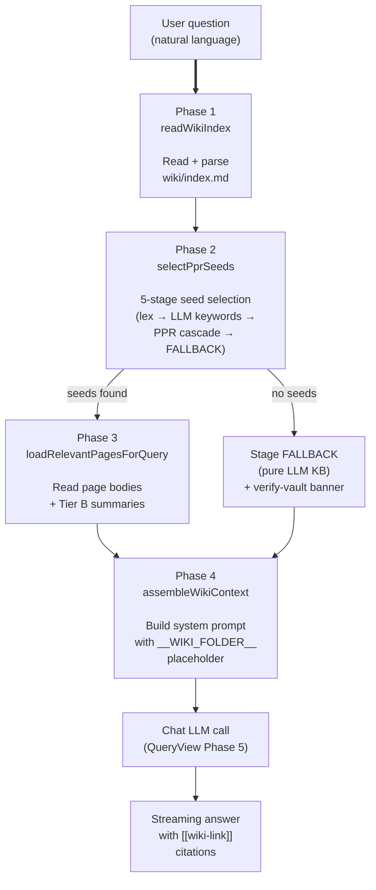
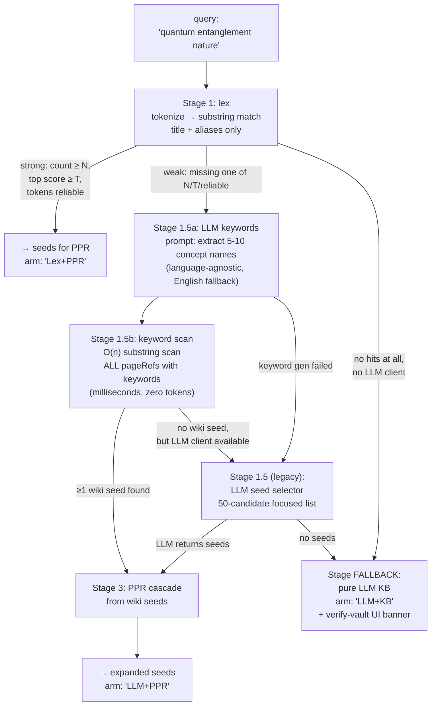

This is the seventh article in the *Inside the System* series. Earlier ones walked through modular architecture, model selection, ingest latency, contradiction detection, schema extraction, and the Monte Carlo PPR engine that powers retrieval. This one opens up the *query-time* side of the engine — the four-phase pipeline that turns a user's natural-language question into a wiki-grounded, citation-backed answer.

If you only want the user-facing story, read [Announcement: v1.24 — Per-Task Models + Query Engine Refactor](/blog/posts/v123-graph-engine-ai-sdk/). This post assumes you're willing to spend 15 minutes inside a 1,000-line refactor.

## The four-phase shape

`QueryView.buildWikiContext` is decomposed into four pipeline phases (from `src/wiki/query-engine/pipeline/`):



The four phases plus the chat-LLM call (Phase 5) form the full query pipeline. Each phase is a pure module under `src/wiki/query-engine/pipeline/` — the largest is 165 LOC, the smallest under 50. PR #250's split decomposed what used to be a 1,373-line `query-engine.ts` god function.

The interesting design decisions live in **Phase 2**, which is itself a five-stage pipeline. This is where the pipeline diverges most from a vanilla RAG system.

## Phase 2 in detail: the five-stage seed selector

When the user asks "量子纠缠的本质", how does the plugin find the right pages? It runs through five stages — each one a fallback to the next:



Three arm labels surface in the UI — `Lex+PPR`, `LLM+PPR`, `LLM+KB` — so the user always knows which stages contributed their answer. The `Lex++PPR` variant covers the rare case where lex was weak, the keyword scan returned nothing, but lex top-K still gets used as last-resort seeds.

The **5-stage shape is the central design decision** of this pipeline. Why five stages instead of one?

## What this is and what it isn't

First, an honest accounting: this isn't RAG in the textbook sense. Standard RAG goes:

1. Embed the query
2. Vector-similarity search against chunk embeddings
3. Top-K chunks → prompt
4. LLM answers with chunks as context

We don't do any of that. We don't embed the query, we don't have a vector store, and we don't fetch chunks by similarity. What we have instead:

- A `[[wiki-link]]` graph (built at ingest time, rebuilt lazily when the wiki folder changes)
- A deterministic page index (`wiki/index.md`) listing every page with path, title, aliases, and summary
- Personalized PageRank (PPR) over the wiki-link graph — see [Inside the System (6): Monte Carlo PPR](/blog/posts/monte-carlo-ppr/) for the algorithm

So what kind of system is this?

**It's a graph-grounded retrieval pipeline**, not a vector retrieval pipeline. The wiki's own structure — what links to what — is the retrieval signal. The LLM's role is interpretation and synthesis, not search.

This distinction matters because **graph signals and embedding signals make different mistakes**. An embedding retrieval over a 2,000-page vault might surface semantically related pages that the user's wiki has never linked to — true-by-similarity but **structurally unrelated**. A graph retrieval surfaces pages that the user's own knowledge graph has marked as connected — **structurally related but possibly semantically surprising**. The choice between them is a stance on what "relevant" means to a personal wiki.

## Five design choices that diverge from vanilla RAG

### 1. Lex-then-PPR beats vector-then-rerank at small-to-medium scale

For wikis under ~2,000 pages, the lex-first cascade is faster and more accurate than an embedding-based retrieval:

- **No embedding cost**: 0 LLM tokens, 0 vector-store IO for Stage 1
- **No cold-start problem**: lex works the moment a page exists; embeddings need an upfront ingest step
- **Deterministic**: same query → same Stage 1 hits → same Stage 3 PPR seeds → same top-K
- **Explainable**: you can show the user which lex tokens matched which titles

The cost shows up at scale. Past ~5,000 pages the lex step starts returning too many weak hits, and a real vector store helps. We considered adding embedding-based retrieval as a Stage 0 (before lex); the v1.23.0 design review discussed it and chose not to, because the empirical R@5 on a 2,142-page real vault was 23.8% — within sampling noise of bge-m3 embeddings on the same vault (see v1.23 release notes). At 2K pages, the cascade's lex path is good enough that adding embeddings would buy us nothing.

This is **not** a permanent verdict. The v1.24 design discussion has an explicit **"source-revision awareness"** workstream, and embedding enrichment is on the v1.25+ roadmap as an opt-in. When we add it, it will sit as a Stage 0 (cold-start retrieval, before Stage 1 lex) — not replacing the cascade.

### 2. Five stages so the LLM augmentation never blocks the hot path

A common pattern in RAG systems is "always call the LLM for query understanding, then vector search." This is wasteful: 90% of the time the query is a simple term that lex handles directly.

Our Stage 1 lex runs **without any LLM call**. Only when lex is *weak* (count below threshold, top score below threshold, or tokens unreliable) do we escalate to Stage 1.5a (LLM keyword generation). This means:

- A query like "January 2026 meeting" hits Stage 1, finds 4 strong lex matches, and never calls the LLM for query understanding
- A query like "what's that concept about X" hits Stage 1 weakly (X isn't a literal title), escalates to Stage 1.5a, gets keywords, scans, finds seeds, runs PPR

The "never call the LLM if you don't have to" principle keeps the hot path fast and cheap. The expensive stages (1.5a, 1.5 legacy) only run when the cheap stages failed.

### 3. Local substring scan > LLM 50-candidate disambiguation

This is the most subtle design choice and worth walking through carefully. The **old v1.23.0 design** did:

```
LLM seed selector: send query + 50 candidates (path, title, summary) → LLM picks up to 3
```

The bug surfaced in real-world use: when a user asked about a concept that lived at index line 1,410 in their vault, the LLM never saw it because the candidate list was sliced from `pageRefs[0..50]`. The relevant page was simply not in the input.

The **v1.24.1 fix** inverts the structure:

```
LLM keyword generation: extract 5-10 concept names from the query
Local substring scan:  O(n) over ALL pageRefs with those keywords (zero tokens)
```

Why this works:

- **LLM extracts concepts, not matches.** The LLM doesn't need to see the candidates to know what the user is asking about. "量子纠缠的本质" → keywords `["量子纠缠", "quantum entanglement", "entanglement", "量子", "quantum"]`.
- **Local scan is exhaustive.** Every page in the vault gets checked, not just the first 50 by wiki-internal order. The page at index line 1,410 is now reachable.
- **Zero token cost.** The scan is O(n) over ~2,000 pageRefs. Each pageRef is title + aliases (~50 chars). The scan runs in milliseconds.
- **Language-agnostic.** The keyword prompt (in `query-keywords.ts`) is explicitly language-agnostic — the LLM auto-detects the query's primary language and emits keywords in that language AND English (the universal cross-language fallback for i18n wikis that may have mixed-language aliases). Hardcoding "Chinese ↔ English" would break Japanese / Korean / French primary speakers.

The pre-v1.24.1 bug is fixed in PR #260's Tier-1+Tier-2 merge triage and v1.24.1 PATCH Phase 5.5.0/5.5.1. The full audit trail is in `src/core/ppr-cascade.ts` and `src/wiki/query-engine/pipeline/query-keywords.ts`.

### 4. `pureLLM` is a first-class state, not a silent fallback

The Stage FALLBACK path — when neither lex nor keyword scan nor LLM seed selector find any wiki-relevant pages — returns an answer mode we call **`pureLLM`**:

- The chat LLM is told: "no relevant pages found; answer from general knowledge"
- The UI surfaces a **"verify-vault" banner** so the user sees this answer is NOT wiki-backed
- The answer has no citations (no source pages to cite)

This is a deliberate choice. The alternative — silently letting the LLM answer without flagging the lack of wiki backing — would teach users that "asking the wiki" returns confident-but-ungrounded answers. That's how RAG systems erode user trust: by not being clear about when the answer is grounded vs. when it's confabulated.

The `pureLLM` flag also feeds back into the cascade for observability: if a high fraction of queries land in `pureLLM`, that's a signal that the wiki's content doesn't cover the topics the user is asking about — useful information for the user (and for future ingest decisions).

### 5. The chat prompt doesn't include the full wiki index

This is the most counterintuitive design choice. The standard RAG failure mode at scale is "the top-K chunks plus the system instructions exceed the context window." The fix is usually better embeddings + chunking.

We took a different path: **we don't put the wiki index in the chat prompt at all**. Instead, we put a compact `pageSummaryHint`:

```
- entities/Foo — Foo | aliases: Foo Corp / FOO
- concepts/Bar — Bar | aliases: bar theory
- sources/qux — Qux paper | aliases: qux-2026
```

This is **path + title + aliases only** — derived from `pageRefs`. The chat LLM sees what pages exist in the wiki (so it can say "I don't know about Baz because Baz isn't in your wiki") without seeing the heavy full-text summaries.

Before v1.24.1, the prompt included the entire `wiki/index.md` text — 70K tokens on a 2,137-page vault. The Phase 5.5.0 PATCH removed this:

> The converted Markdown already gives the LLM the content it needs; an optional `pageSummaryHint` (a compact path/title/aliases list derived from pageRefs) can be supplied by the caller if it wants the LLM to know about non-retrieved pages. The wiki structure is implied by the loaded pages and the entity/concept/source folder convention below.

The 70K-token savings matter most for users on free-tier models with 8K–32K context windows. They can now use the plugin without truncation-induced hallucinations.

### Bonus 6. `__WIKI_FOLDER__` placeholder prevents stale-folder leak

A subtle bug we hit in v1.24.0 (Bug C 3.0): the chat LLM is asked to render `[[wiki-link]]` paths using the user's current `settings.wikiFolder`. If we baked the real folder into the prompt, and the user's chat history persisted that prompt (and the LLM's response with rendered paths), the LLM would then re-use those paths in subsequent prompts — even after the user changed `wikiFolder`.

Fix: use the literal placeholder `__WIKI_FOLDER__` everywhere in the system prompt. Render-time substitution (in `thinking-extract.ts`) replaces the placeholder with the *current* folder for display only. The LLM never sees the literal folder, so it never bakes one into its behavior.

This is the kind of bug that's invisible until you actually change a setting — and then it ruins the answer. The placeholder fix is one line but pays off forever.

## Cost and latency, empirically

For a 2,000-page vault on a typical query:

| Stage | Latency (typical) | LLM tokens | Notes |
|-------|------------------:|-----------:|-------|
| Phase 1: readWikiIndex | 5–15 ms | 0 | File read + parse |
| Stage 1: lex | 1–3 ms | 0 | Pure substring scan |
| Stage 1.5a: LLM keywords | 200–800 ms | 50–150 | Only when Stage 1 weak |
| Stage 1.5b: keyword scan | 1–5 ms | 0 | O(n) over pageRefs |
| Stage 3: PPR cascade | 30–80 ms | 0 | Monte Carlo, K=3000 L=20 |
| Phase 3: loadPages | 50–200 ms | 0 | I/O bound |
| Phase 4: assemble | 1–5 ms | 0 | Pure template build |
| Phase 5: chat LLM | 1–4 s | 2–8K | Streaming output |

For a "strong lex" query (e.g. "January 2026 meeting"): total ≤300 ms before chat LLM. PPR runs in <80 ms even at K=3000 walks.

For a "weak lex, LLM keywords" query: adds 200–800 ms for Stage 1.5a, but only when needed.

For a "pure LLM KB" fallback: skips PPR entirely, falls through to chat with the `pureLLM=true` flag.

The latencies are all **perceived-as-instant** by humans except the chat LLM call — which is unavoidable regardless of retrieval strategy.

## What this design gives up

Honest accounting of the tradeoffs:

- **No semantic similarity.** A page that mentions "feline" won't match a query for "cat" unless the page has an alias for it. Embeddings would bridge this; we don't.
- **No semantic cross-language.** A Chinese query about a page written only in English needs an explicit cross-language alias. Embeddings would auto-bridge; we don't.
- **No chunk-level retrieval.** A page is atomic. If only one section of a long page is relevant, you get the whole page (truncated to MAX_PAGE_CONTENT_CHARS). Embeddings over chunks would help; we don't.
- **Lex can miss idiomatic phrasing.** A query "what's that thing about X" hits Stage 1 weakly; only the LLM keyword stage can save it.

These are **real limitations**, not theoretical ones. The cascade is biased toward what the user has explicitly linked and named. For a personal wiki where the user is the author, that bias is often the right one — but for a multi-author wiki or a domain where natural-language phrasing varies widely, embeddings would be a strict win.

The roadmap (Discussion #246) covers opt-in embedding enrichment as a Stage 0. It will be **opt-in**, not the default, because the lex-PPR cascade is fast, deterministic, and zero-token — and the marginal accuracy gain on a well-curated personal wiki is small.

## Why this matters for users

If you've read this far, here's the takeaway: **the answer you see from Query Wiki is structurally honest about what it knows and doesn't know**. The arm labels (`Lex+PPR`, `LLM+PPR`, `LLM+KB`), the `pureLLM` flag, the verify-vault banner, the `__WIKI_FOLDER__` placeholder — these aren't engineering hygiene. They're the design choices that make a personal wiki feel like a wiki instead of a chatbot with a costume.

The plugin's stance is: your wiki's structure is the source of truth. The LLM is the interpreter. PPR is the navigator. Embeddings are optional enrichment we'll add when they pay for themselves.

If you want the deeper read on any specific piece:

- PPR algorithm: [Inside the System (6): Monte Carlo PPR](/blog/posts/monte-carlo-ppr/)
- Hub identification using PPR: `src/core/hub-detection.ts`
- PPR cascade arms: `src/core/ppr-cascade.ts`
- The seed selector stages: `src/wiki/query-engine/pipeline/select-seeds.ts`
- The keyword generation prompt: `src/wiki/query-engine/pipeline/query-keywords.ts`
- The placeholder fix: `src/wiki/query-engine/pipeline/assemble-context.ts` (Bug C 3.0)
- v1.24 release notes: the per-call-site model resolution in `core/model-resolver.ts`

The v1.24.0 PATCH (Phases 5.5.0 and 5.5.1) is what made this pipeline trustworthy at scale. The five-stage shape is what makes it fast. The `pureLLM` honesty is what makes it worth using.