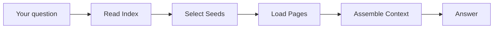

This is the seventh article in the *Inside the System* series. If you only want the user-facing story of what shipped, read [Announcement: v1.24 — Per-Task Models + Query Engine Refactor](/blog/posts/v123-graph-engine-ai-sdk/). This one is for the people who want to know *why the answers behave the way they do* — technical Obsidian users willing to spend fifteen minutes inside the architecture. No source-code tour, no line numbers. Just the design decisions and the reasoning behind them.

## The shape, briefly

When you ask a question, four things happen in order before a single token of the answer is generated.



**Read Index** opens the wiki's table of contents — a plain-text index listing every page with its path, title, and aliases. **Select Seeds** decides which handful of pages are actually relevant to your question. **Load Pages** reads the bodies of those pages. **Assemble Context** builds the prompt that goes to the chat model, and then the model streams back an answer with `[[wiki-link]]` citations pointing at the pages it used.

Three of those four phases are almost boring. Reading the index is a file read. Loading pages is I/O. Assembling context is string templating. If the pipeline were a movie, they'd be establishing shots.

Almost all of the interesting design decisions live in the second phase — Select Seeds. That's where the pipeline decides what "relevant" means, whether to spend any model tokens at all, and what to do when your wiki simply doesn't cover the thing you asked about. So that's where we're going to spend our time.

## The first fork in the road: this is not a vector system

Before the design choices, one framing decision that colors everything else.

Textbook RAG — retrieval-augmented generation — works like this: embed your question into a vector, do a similarity search against a store of embedded document chunks, take the top few chunks, stuff them into the prompt, let the model answer. Almost every "chat with your notes" tool you've tried does some version of this.

This pipeline does none of it. There's no embedding of your query, no vector store, no chunk-similarity search. Instead the retrieval signal is your wiki's own structure — the `[[wiki-link]]` graph that the plugin built when it ingested your notes. Relevance is computed with Personalized PageRank walking that graph, seeded from the pages your question most directly names. (The PPR engine has its own writeup: [Inside the System (6): Monte Carlo PPR](/blog/posts/monte-carlo-ppr/).)

The distinction matters because graph signals and embedding signals make *different mistakes*. An embedding search over a 2,000-page vault will happily surface pages that are semantically similar to your question but that you have never once linked to — true-by-similarity, but structurally strangers in your own knowledge base. A graph search surfaces pages that *your own linking behavior* has already marked as connected — structurally related, occasionally semantically surprising. Choosing the graph is a stance on what "relevant" means for a *personal* wiki: it means "related in the way you, the author, decided things are related," not "related in the way a general-purpose embedding model thinks things are related."

That single choice is why the answers cite pages, why they feel tied to your notes rather than to the internet, and why the pipeline can tell you honestly when your wiki has nothing to say. With that framing in place, here are the five design choices inside Select Seeds that follow from it.

## Choice 1: Lex-then-PPR, the decision that this isn't a vector system

The seed selector's first move is the cheapest one imaginable: tokenize your question and do a plain substring match against page titles and aliases. No model call, no vectors, no I/O beyond the index that's already in memory. If your question was "January 2026 meeting" and you have a page titled exactly that, the match is instant and unambiguous.

Those matched pages become the *seeds* for a Personalized PageRank walk over your link graph, which expands outward to the pages your wiki has connected to them. The whole thing is deterministic: the same question produces the same matches, the same seeds, and the same ranked results, every time.

Why start with something so unsophisticated? Because at the scale most personal wikis actually live at — a few hundred to a couple thousand pages — lexical-plus-graph beats embed-then-rerank on nearly every axis that matters:

- It costs **zero tokens and zero vector I/O** for the common case.
- It has **no cold-start problem** — a page is findable the instant it exists, with no embedding pass to run first.
- It's **deterministic**, so behavior is reproducible and debuggable.
- It's **explainable** — the plugin can literally show you which words in your question matched which page titles.

There is an honest ceiling here, and it's worth naming clearly rather than burying. Past roughly 5,000 pages, the lexical step starts returning too many weak matches — common words collide with too many titles — and a real vector store would genuinely help. Measured on a real 2,142-page vault, recall-at-5 for the lex-PPR cascade came in within sampling noise of a strong embedding model on the same vault. At that scale, embeddings would have bought essentially nothing while adding an ingest-time embedding pass, a vector store to maintain, and per-query embedding cost. So they weren't added. Not "embeddings are bad" — "embeddings don't pay for themselves yet, at this scale." When they do, they'll slot in as an optional pre-lex stage, not a replacement for the cascade.

## Choice 2: Five stages, the decision that the hot path stays fast

A tempting way to build a query engine is: always send the question to a model first to "understand" it, then retrieve. It feels smart. It's also wasteful, because the overwhelming majority of real questions are simple enough that the substring match already nailed them. Paying a model round-trip on every single query to re-derive something you already have is latency and cost set on fire.

So Select Seeds is built as a cascade of stages, each one a fallback for the last, and the expensive stages only fire when the cheap ones come up short. The first stage is the lexical match from Choice 1 — no model involved. The plugin only escalates when that match is *weak*: too few hits, or the top hit isn't confident enough, or the tokenization looks unreliable (which happens with, say, unsegmented CJK text).

Concretely:

- "January 2026 meeting" hits the lexical stage, finds a strong exact match, and never touches a model for retrieval. Milliseconds.
- "that thing we discussed about pricing psychology" hits the lexical stage weakly — none of those words is a literal page title — and *only then* escalates to a model-assisted stage to figure out what pages you might mean.

The five stages, in order: lexical match; model keyword extraction (only when lexical is weak); a local substring scan over every page using those keywords; PPR expansion from the seeds; and a fallback that fires when nothing matches. The principle is "never call the model if you don't have to." About 90% of queries never need the escalation, so 90% get answered with a retrieval step measured in single-digit milliseconds. The model still writes the final answer, of course — that latency is unavoidable and identical no matter how you retrieve. But the *retrieval* stays off the model's critical path unless it genuinely needs help.

## Choice 3: Local scan over model disambiguation, the decision that fixed a real bug

This is the subtlest choice in the whole pipeline, and the best way to explain it is to tell the story of the bug that forced it.

Before v1.24.1, the escalation path worked like this: when the lexical match was weak, the plugin sent the model your question *plus a list of up to 50 candidate pages* — path, title, and summary for each — and asked it to pick the three most relevant. On paper, reasonable: let the smart model disambiguate.

Then a user reported that a question about a topic they'd definitely written about came back with nothing useful. The investigation found the cause. Their vault had thousands of pages. The relevant page sat around index position 1,410. And the candidate list handed to the model was the *first 50 pages* by the wiki's internal ordering. The model never disambiguated the right page, because the right page was never in the list. It had been sliced off before the model ever saw it. The model did its job perfectly on a set of candidates that didn't contain the answer.

You can't fix that by making the model smarter. The information was gone before the model's turn. So the entire structure was inverted. Instead of asking the model to *pick from candidates*, it now asks the model to *extract concepts*:

```
Question: "什么是量子纠缠的本质"
Model extracts keywords:
["量子纠缠", "quantum entanglement", "entanglement", "量子", "quantum"]
```

Then the plugin takes those keywords and does a local substring scan over **every page in the vault** — not the first 50, all of them. The page at position 1,410 is now just as reachable as the page at position 3.

Four things make this the right shape:

- **The model extracts intent, not matches.** It doesn't need to see your pages to know what you're asking about. Naming the concept is a language task; finding the pages is a search task. The two were conflated before; now they aren't.
- **The scan is exhaustive.** Every page gets checked. There is no arbitrary window to fall outside of.
- **It costs nothing to scan.** The keyword extraction is a small model call; the scan itself is a linear pass over a few thousand short strings — title and aliases, tens of characters each. It finishes in milliseconds with zero tokens.
- **It's language-agnostic by design.** The extraction prompt asks for keywords in the question's own primary language *and* in English as a universal fallback. A Japanese, Korean, or French speaker gets keywords that match their pages, plus English variants for the mixed-language aliases that real multilingual vaults are full of. Hardcoding "Chinese-or-English" would have quietly broken everyone else.

This is the choice worth being proudest of, precisely because the failure it fixed was invisible until a real person hit it. The seeds this stage finds feed straight into the same PPR walk from Choice 1, and the UI labels the result so you can see the model helped find the entry points.

While we're here: those labels are the arms you may have noticed in the interface. **`Lex+PPR`** means the lexical match was strong enough on its own — no model needed to find your pages. **`LLM+PPR`** means the lexical match was weak, the model extracted keywords, the local scan found seeds, and PPR expanded from them. **`LLM+KB`** means none of that found anything in your wiki — which brings us to the fourth choice.

## Choice 4: pureLLM as a first-class state, the decision that keeps the plugin honest

Sometimes the answer to "which pages are relevant" is *none*. You asked about something your wiki genuinely doesn't cover. Every retrieval system hits this case. The difference is entirely in what you do about it.

The lazy option is to let the model answer anyway from its general training, and say nothing. The answer comes out fluent and confident, indistinguishable from a wiki-grounded one — and the user slowly learns that "asking my wiki" produces authoritative-sounding answers whether or not the wiki actually knows anything. That's exactly how trust in these tools erodes: not through obvious errors, but through confident answers that were never grounded and never labeled as such.

The opposite choice was made. When retrieval comes up empty, the pipeline enters an explicit state called **pureLLM**, and it is a real, named branch of the system rather than a silent fallthrough:

- The chat model is told plainly: no relevant pages were found; answer from general knowledge and don't pretend otherwise.
- The interface shows a **verify-vault banner** so you can see at a glance that this answer is *not* backed by your notes.
- The answer carries **no citations**, because there are no source pages to cite. The absence of `[[wiki-links]]` is itself a signal.

This is the line between a wiki and a chatbot wearing a wiki costume. A wiki that will confidently improvise about things it doesn't contain isn't a wiki; it's a chatbot with your notes bolted on as decoration. Marking the pureLLM state loudly is what keeps the tool honest — when it cites pages, it really used them, and when it can't, it says so.

There's a quiet second benefit. Because pureLLM is a named state, it's countable. If a large fraction of your questions are landing in pureLLM, that's a concrete signal that your wiki doesn't cover what you keep asking about — useful information for you, and a good prompt to ingest more source material. Honesty turns out to be observable, and observability turns out to be useful.

## Choice 5: A compact index hint over the full wiki dump, the decision that lets small models work too

One more counterintuitive choice, and it's about the prompt itself.

The naive way to give the model wiki-awareness is to paste the entire wiki index into the system prompt — every page, its title, its summary. On a 2,000-page vault that index ran to roughly 70,000 tokens. For anyone on a large-context frontier model, that's merely wasteful. For anyone on a free-tier or local model with an 8K–32K context window, it's fatal: the index alone blows past the window, the prompt gets truncated, and truncated prompts produce exactly the confident hallucinations the design is trying to avoid.

Here's the thing, though — after PPR has already ranked and selected the relevant pages, the model *doesn't need* the full index. The pages it should reason about are already loaded into the context as actual content. What it needs beyond that is just enough awareness of what *else* exists in the wiki to say "I don't have a page on Baz" instead of inventing one. That takes a compact hint, not a data dump:

```
- entities/Foo — Foo | aliases: Foo Corp / FOO
- concepts/Bar — Bar | aliases: bar theory
- sources/qux — Qux paper | aliases: qux-2026
```

Path, title, and aliases — nothing more. The heavy per-page summaries stay out of the prompt entirely, because the pages that matter are already present as full content and the pages that don't matter only need to be *nameable*, not *described*. That compact hint costs a fraction of the tokens, and it's what lets someone running a modest local model get the same structurally-honest behavior as someone on a top-tier hosted one. The design doesn't quietly assume you can afford a giant context window.

## The one-line fix that mattered: the folder placeholder

A quick war story, because it's a good illustration of how a tiny bug can silently corrupt answers.

The chat model needs to know your wiki's folder name so it can render `[[wiki-link]]` paths correctly. The obvious thing is to bake the real folder name straight into the prompt. That worked — until someone renamed their wiki folder. Their chat history had persisted old prompts and old answers with the *previous* folder name baked in, the model saw those as examples of "how paths look here," and it happily kept emitting links pointing at a folder that no longer existed. Renaming a folder silently broke every subsequent answer, and nothing in the UI hinted at why.

The fix is one line of concept: never put the real folder name in the prompt. Use a literal placeholder — `__WIKI_FOLDER__` — everywhere, and substitute the *current* folder name at display time only, for rendering. The model never sees a real folder name, so it can never memorize a stale one. One placeholder, and an entire class of "I renamed something and now answers are subtly wrong" bugs just stops existing. Those are the best fixes: small, permanent, and invisible once they work.

## The tradeoff, stated plainly

Every design choice gives something up, and it's better to hear the costs up front than to discover them yourself.

**Embeddings aren't in here**, which means there's no true semantic matching. A page that talks about "feline behavior" won't surface for a question about "cats" unless the page carries "cat" as an alias, because the match is lexical, not conceptual. The same gap shows up across languages: a Chinese question won't automatically find an English-only page without an explicit cross-language alias — the keyword-extraction stage helps here, but it's not the same as the automatic bridging embeddings would give you. The tradeoff is accepted because on a personal wiki *you* are the author, and the aliases and links you created are usually a better relevance signal than a general model's notion of similarity. On a sprawling multi-author wiki, or a domain where people phrase the same idea fifty different ways, that calculus flips and embeddings would be a clear win. It's a tradeoff, tuned deliberately for the personal-wiki case.

**Chunk-level retrieval isn't in here** either. A page is atomic — if one paragraph of a long page is what's relevant, you still get the whole page (capped at a maximum length), not the surgical slice a chunking system would extract. This keeps the graph model clean: nodes are pages, links are between pages, and PPR walks a graph of whole pages. Introducing sub-page chunks would fracture that model for a precision gain that, on human-scale personal notes, is usually marginal.

These aren't hypothetical limitations dressed up as features. They're real, and the cascade is genuinely biased toward what you've explicitly named and linked. For the person writing and querying their own knowledge base, that bias is usually correct. Embedding enrichment is on the roadmap as an *opt-in* Stage 0 for the cases where it isn't — cold-start retrieval that runs before the lexical stage, never replacing it.

## Cost and latency

For a roughly 2,000-page vault, here's where the time and tokens actually go on a typical query.

| Stage | Latency (typical) | Model tokens |
|-------|------------------:|-------------:|
| Read index | 5–15 ms | 0 |
| Lexical match | 1–3 ms | 0 |
| Keyword extraction (only when lex is weak) | 200–800 ms | 50–150 |
| PPR expansion | 30–80 ms | 0 |
| Load pages | 50–200 ms | 0 |
| Chat model (streaming answer) | 1–4 s | 2–8K |

The read across that table is the whole thesis in numbers. A strong-lexical query reaches the chat model in under 300 milliseconds of retrieval work, spending zero tokens on retrieval. A weak-lexical query adds a few hundred milliseconds for keyword extraction — but only when it's needed. And everything above the chat-model row is perceived as instant by a human. The one genuinely slow, genuinely expensive step is the chat model writing the answer, and that cost is identical no matter how you retrieve. The entire point of the cascade is to make sure you're not paying model latency *twice* — once to understand the query and again to answer it — when 90% of the time understanding it was free.

## Why this matters if you use the plugin

Here's the payoff for reading this far. The answers you get from this plugin are *structurally* honest about what they know and don't know — not honest as a matter of the model's good behavior, which can't be relied on, but honest as a matter of how the pipeline is built.

That's what the arm labels are telling you. See **`Lex+PPR`** and you know your question matched your pages cleanly, no model guessing involved. See **`LLM+PPR`** and you know the model helped name what you were after, then your own link graph did the finding. See **`LLM+KB`** with a verify-vault banner and you know, unambiguously, that this answer came from the model's general training and *not* from your notes — believe it accordingly. The presence or absence of `[[wiki-link]]` citations tells you the same story from another angle.

Choosing a graph-grounded pipeline over a vector-grounded one, keeping the model off the hot path, extracting keywords instead of slicing candidate lists, making pureLLM a loud first-class state instead of a silent fallthrough, sending a compact hint instead of a 70K-token dump, hiding the folder name behind a placeholder — none of these are engineering hygiene for its own sake. They're the concrete decisions that let a pile of Markdown files behave like a wiki you can trust instead of a chatbot in a costume. The wiki's structure is the source of truth. The model is the interpreter. PPR is the navigator. Embeddings are enrichment to be added the day they earn their place — and not before.

If you want to go deeper on the retrieval math itself, [Inside the System (6): Monte Carlo PPR](/blog/posts/monte-carlo-ppr/) covers the algorithm that powers the expansion step.
